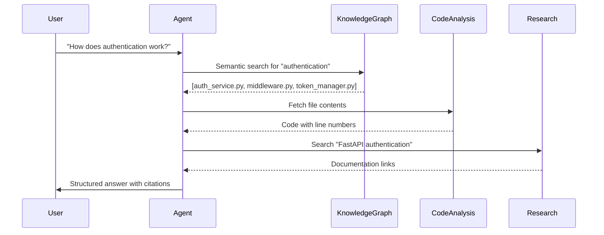

The Ask Agent answers questions about your codebase through semantic search and knowledge graph traversal. It locates relevant code, analyzes relationships, and provides comprehensive answers with precise citations.

<Note>
  **Looking for something specific?**
  - [Tools Reference](/agents/tools-reference) - Complete tool documentation
  - [Choose an Agent](/agents/introduction#agent-selection-guide) - Agent selection guide
</Note>

<CardGroup cols={2}>
  <Card title="Quick Start" icon="rocket" href="#quick-start">
    Get started in 30 seconds
  </Card>
  <Card title="API Reference" icon="code" href="#api-overview">
    Request/response documentation
  </Card>
  <Card title="Use Cases" icon="lightbulb" href="#common-use-cases">
    Find code and explore architecture
  </Card>
  <Card title="19 Specialized Tools" icon="wrench" href="#available-tools">
    Knowledge graph and code analysis
  </Card>
</CardGroup>

## Quick Start

Get answers about your codebase using the REST API.


**Agent Processing**

The agent analyzes your codebase by fetching relevant files and building context to answer your question.


**Detailed Response**

The agent provides a comprehensive, structured answer with evidence from your codebase.


**Actionable Next Steps**

The response concludes with suggested follow-up questions and next steps tailored to your workflow.


<Steps>
  <Step title="Create a Conversation">
    <CodeGroup>
    ```python Python
    import requests

    # Create conversation with codebase_qna_agent
    response = requests.post(
        "https://production-api.potpie.ai/api/v1/conversations/",
        headers={"Authorization": "Bearer <token>"},
        json={
            "user_id": "user_123",
            "title": "Understanding Authentication",
            "status": "active",
            "project_ids": ["proj_abc123"],
            "agent_ids": ["codebase_qna_agent"]
        }
    )

    conversation_id = response.json()["conversation_id"]
    ```

    ```javascript JavaScript
    const response = await fetch(
      'https://production-api.potpie.ai/api/v1/conversations/',
      {
        method: 'POST',
        headers: {
          'Authorization': 'Bearer <token>',
          'Content-Type': 'application/json'
        },
        body: JSON.stringify({
          user_id: 'user_123',
          title: 'Understanding Authentication',
          status: 'active',
          project_ids: ['proj_abc123'],
          agent_ids: ['codebase_qna_agent']
        })
      }
    );

    const { conversation_id: conversationId } = await response.json();
    ```

    ```bash cURL
    curl -X POST https://production-api.potpie.ai/api/v1/conversations/ \
      -H "Authorization: Bearer <token>" \
      -H "Content-Type": 'application/json" \
      -d '{
        "user_id": "user_123",
        "title": "Understanding Authentication",
        "status": "active",
        "project_ids": ["proj_abc123"],
        "agent_ids": ["codebase_qna_agent"]
      }'
    ```
    </CodeGroup>
  </Step>

  <Step title="Send Your Question">
    <CodeGroup>
    ```python Python
    # Send message to conversation (uses Form data)
    message_response = requests.post(
        f"https://production-api.potpie.ai/api/v1/conversations/{conversation_id}/message/",
        headers={"Authorization": "Bearer <token>"},
        data={
            "content": "Where is authentication implemented?"
        },
        params={"stream": False}
    )

    answer = message_response.json()["response"]
    print(answer)
    # Output: Markdown-formatted answer with file citations
    ```

    ```javascript JavaScript
    // Uses Form data
    const formData = new FormData();
    formData.append('content', 'Where is authentication implemented?');

    const messageResponse = await fetch(
      `https://production-api.potpie.ai/api/v1/conversations/${conversationId}/message/?stream=false`,
      {
        method: 'POST',
        headers: {
          'Authorization': 'Bearer <token>'
        },
        body: formData
      }
    );

    const { response: answer } = await messageResponse.json();
    console.log(answer);
    ```

    ```bash cURL
    # Uses Form data (multipart/form-data)
    curl -X POST "https://production-api.potpie.ai/api/v1/conversations/{conversation_id}/message/?stream=false" \
      -H "Authorization: Bearer <token>" \
      -F "content=Where is authentication implemented?"
    ```
    </CodeGroup>
  </Step>

  <Step title="Review the Answer">
    The agent returns:
    - Comprehensive markdown-formatted explanation
    - Precise file paths with line numbers
    - Code snippets from relevant files
    - Citations for all referenced code

    <Accordion title="See example response">
    ```markdown
    ## Authentication Implementation

    Authentication is handled in three components:

    ### AuthService (app/services/auth_service.py:15-89)

    The AuthService class manages user authentication and credential verification...
    ```
    </Accordion>
  </Step>
</Steps>

## API Overview

The Ask Agent operates through the [Conversations API](/api-reference/endpoint/create-conversation). You create a conversation with the agent, then send messages. The agent processes questions using 19 specialized tools and returns structured markdown responses with code citations.

**Authentication:** Bearer token required (Firebase auth)

### Conversation Request Format

```typescript
{
  user_id: string            // User identifier
  title: string              // Conversation title
  status: "active"           // Conversation status
  project_ids: string[]      // Projects to query
  agent_ids: ["codebase_qna_agent"]  // Agent to use
}
```

### Message Request Format

**Form data:**
```typescript
{
  content: string            // Your question about the codebase (Form field)
  node_ids?: string          // Optional: JSON string of NodeContext[] (Form field)
  images?: File[]            // Optional: Image attachments (Form field)
  stream?: boolean           // Query parameter: whether to stream response (default: true)
}
```

**Note:** API uses `multipart/form-data`, not JSON. The `content` field is required.

### Response Format

```typescript
{
  response: string           // Markdown-formatted answer
  tool_calls: ToolCall[]     // Tools invoked during exploration
  citations: string[]        // Files referenced in response
}
```

## How It Works

The agent enriches context before processing. It fetches code from referenced node IDs. It retrieves the file structure of your project. This context helps the agent understand your codebase layout.

The agent then processes your query using its knowledge graph tools. It locates relevant code across files. It builds relationships between components. It synthesizes findings into a structured response.

### Processing Flow

```mermaid
graph LR
    A[User Query] --> B[Context Enrichment]
    B --> C{Query Complexity}
    C -->|Simple| D[Single-Agent Mode]
    C -->|Complex| E[Multi-Agent Mode]
    D --> F[Tool Selection]
    E --> G[Sub-Agent Delegation]
    F --> H[Knowledge Graph Search]
    G --> H
    H --> I[Code Analysis]
    I --> J[Response Generation]
    J --> K[Markdown Answer + Citations]

    style A fill:#e1f5ff,stroke:#333,color:#000
    style B fill:#f0f0f0,stroke:#333,color:#000
    style C fill:#fff4e1,stroke:#333,color:#000
    style D fill:#e8f4f8,stroke:#333,color:#000
    style E fill:#f4e8f8,stroke:#333,color:#000
    style F fill:#e8f8f4,stroke:#333,color:#000
    style G fill:#f8f4e8,stroke:#333,color:#000
    style H fill:#f0e8f8,stroke:#333,color:#000
    style I fill:#e8f8e8,stroke:#333,color:#000
    style J fill:#f8e8e8,stroke:#333,color:#000
    style K fill:#d4f4dd,stroke:#333,color:#000
```



The agent follows this workflow for every query:

1. **User Query**: Receives your question about the codebase
2. **Context Enrichment**: Loads referenced files and project structure
3. **Query Complexity**: Determines if simple or complex
   - **Simple**: Single-Agent Mode → Tool Selection
   - **Complex**: Multi-Agent Mode → Sub-Agent Delegation
4. **Knowledge Graph Search**: Finds relevant code semantically
5. **Code Analysis**: Examines code structure and relationships
6. **Response Generation**: Synthesizes findings with precise citations
7. **Markdown Answer + Citations**: Returns formatted response with file references

<Accordion title="Advanced: Multi-Agent Architecture">
For complex queries, the Ask Agent automatically activates multi-agent mode:

- **Main Agent**: Coordinates overall task and gathers information
- **Q&A Specialist**: Synthesizes findings into comprehensive answers (12 iterations)
- **Integration Agents**: Handle framework-specific queries

This happens automatically—you don't need to configure anything. The agent delegates to specialists when it detects complex queries requiring synthesis or specialized knowledge.

**You can tell multi-agent mode activated when:**
- Query requires information from 5+ files
- Answer needs synthesis across multiple systems
- Integration-specific knowledge required (e.g., Django ORM, React hooks)
</Accordion>

### How Tools Work Together



## Common Use Cases

<CardGroup cols={3}>
  <Card title="Finding Code" icon="crosshairs" href="#finding-code">
    Locate where features live
  </Card>
  <Card title="Understanding Features" icon="book-open" href="#understanding-features">
    Learn how things work
  </Card>
  <Card title="Exploring Architecture" icon="diagram-project" href="#exploring-architecture">
    Get system overviews
  </Card>
</CardGroup>

### Finding Code

Locate where specific functionality lives in your codebase.

<AccordionGroup>
  <Accordion title="E-commerce: Find Payment Processing" icon="credit-card" defaultOpen={true}>
    **Question:**
    ```
    "Show me the complete payment flow from cart checkout to order confirmation"
    ```

    **What the agent does:**
    1. Searches for "payment", "checkout", "order" semantically
    2. Maps relationships between payment service, cart, and orders
    3. Traces the complete flow across multiple files

    **Response includes:**
    - Payment processor integration code
    - Cart validation logic
    - Order creation workflow
    - Transaction handling
    - Email notification triggers

    <CodeGroup>
    ```python Python
    # Send message in the same conversation
    response = requests.post(
        f"https://production-api.potpie.ai/api/v1/conversations/{conversation_id}/message/",
        headers={"Authorization": "Bearer <token>"},
        data={
            "content": "Show me the complete payment flow from cart checkout to order confirmation"
        },
        params={"stream": False}
    )
    ```

    ```javascript JavaScript
    // Send message in the same conversation
    const response = await fetch(
      `https://production-api.potpie.ai/api/v1/conversations/${conversationId}/message/`,
      {
        method: 'POST',
        headers: {
          'Authorization': 'Bearer <token>',
          'Content-Type': 'application/json'
        },
        body: JSON.stringify({
          content: 'Show me the complete payment flow from cart checkout to order confirmation'
        })
      }
    );
    ```
    </CodeGroup>
  </Accordion>

  <Accordion title="SaaS: Find API Endpoints" icon="plug">
    **Question:**
    ```
    "List all API endpoints related to user management"
    ```

    **Response format:**
    ```markdown
    ## User Management API Endpoints

    Found 8 endpoints across 2 route files:

    ### User CRUD Operations (api/routes/users.py:12-89)
    - POST /api/v1/users - Create user
    - GET /api/v1/users/:id - Get user details
    - PUT /api/v1/users/:id - Update user
    - DELETE /api/v1/users/:id - Delete user

    ### Authentication (api/routes/auth.py:15-67)
    - POST /api/v1/auth/login - User login
    - POST /api/v1/auth/logout - User logout
    - POST /api/v1/auth/refresh - Refresh token
    - POST /api/v1/auth/reset-password - Password reset
    ```
  </Accordion>

  <Accordion title="Data Pipeline: Find Database Queries" icon="database">
    **Question:**
    ```
    "Where do we query the orders table?"
    ```

    **What you get:**
    - All SQL queries for orders table
    - ORM model definitions
    - Query optimization notes
    - Index usage
    - Transaction boundaries
  </Accordion>
</AccordionGroup>

### Understanding Features

Learn how features work by asking natural language questions.

<AccordionGroup>
  <Accordion title="Authentication Flow" icon="lock" defaultOpen={true}>
    **Question:**
    ```
    "How does authentication work in this app?"
    ```

    **The agent traces:**
    1. Login endpoint → AuthService → Database
    2. Token generation → JWT configuration
    3. Middleware verification → Protected routes
    4. Session management → Logout flow

    **Example response snippet:**
    ```markdown
    ## Authentication System Overview

    Authentication uses JWT tokens with refresh token rotation:

    ### 1. Login Flow (app/services/auth_service.py:15-89)

    User submits credentials → AuthService validates → Returns access + refresh tokens

    [Code snippet shown]

    ### 2. Token Validation (app/middleware/auth.py:12-34)

    Every protected route checks token validity via middleware...
    ```

    <CodeGroup>
    ```python Python
    # Ask initial question
    response = requests.post(
        f"https://production-api.potpie.ai/api/v1/conversations/{conversation_id}/message/",
        headers={"Authorization": "Bearer <token>"},
        data={
            "content": "How does authentication work in this app?"
        },
        params={"stream": False}
    )

    # Follow-up question in same conversation maintains context
    followup = requests.post(
        f"https://production-api.potpie.ai/api/v1/conversations/{conversation_id}/message/",
        headers={"Authorization": "Bearer <token>"},
        data={
            "content": "What happens if the token expires?"
        },
        params={"stream": False}
    )
    ```
    </CodeGroup>
  </Accordion>

  <Accordion title="Data Flow Tracing" icon="arrow-right-arrow-left">
    **Question:**
    ```
    "Trace what happens when a user submits a form"
    ```

    **Response includes:**
    - Frontend form submission code
    - API endpoint handler
    - Validation logic
    - Database persistence
    - Background job triggers
    - Email notification
    - Success/error responses
  </Accordion>
</AccordionGroup>

### Exploring Architecture

Get high-level system overviews and identify patterns.

<AccordionGroup>
  <Accordion title="Design Patterns Analysis" icon="shapes">
    **Question:**
    ```
    "What design patterns are used in this codebase?"
    ```

    **The agent identifies:**
    - Repository pattern (data access)
    - Factory pattern (object creation)
    - Observer pattern (event handling)
    - Singleton pattern (configuration)
    - Strategy pattern (payment processors)

    With code examples for each.
  </Accordion>

  <Accordion title="Dependency Mapping" icon="sitemap">
    **Question:**
    ```
    "What does the UserService depend on?"
    ```

    **Response shows:**
    ```markdown
    ## UserService Dependencies

    ### Direct Dependencies
    - UserRepository (data access)
    - EmailService (notifications)
    - CacheManager (performance)
    - Logger (observability)

    ### Transitive Dependencies
    - Database connection pool (via Repository)
    - Redis client (via CacheManager)
    - SMTP client (via EmailService)

    ### Dependents (What uses UserService)
    - AuthService
    - ProfileController
    - AdminDashboard
    ```
  </Accordion>
</AccordionGroup>

<Tip>
  **Pro tip**: Ask follow-up questions in the same conversation to dive deeper. Use the same `conversation_id` to maintain context.
</Tip>

## Example Request

<CodeGroup>
```bash cURL
# Send message to existing conversation
curl -X POST https://production-api.potpie.ai/api/v1/conversations/{conversation_id}/message/ \
  -H "Authorization: Bearer <token>" \
  -H "Content-Type: application/json" \
  -d '{
    "content": "Where is authentication implemented?"
  }'
```

```python Python
import requests

# Send message to existing conversation
response = requests.post(
    f"https://production-api.potpie.ai/api/v1/conversations/{conversation_id}/message/",
    headers={"Authorization": "Bearer <token>"},
    json={
        "content": "Where is authentication implemented?",
        "user_id": "user_123"
    }
)

answer = response.json()["response"]
print(answer)
```

```javascript JavaScript
// Send message to existing conversation
const response = await fetch(
  `https://production-api.potpie.ai/api/v1/conversations/${conversationId}/message/`,
  {
    method: 'POST',
    headers: {
      'Authorization': 'Bearer <token>',
      'Content-Type': 'application/json'
    },
    body: JSON.stringify({
      query: 'Where is authentication implemented?',
      user_id: 'user_123'
    })
  }
);

const { response: answer } = await response.json();
console.log(answer);
```
</CodeGroup>

## Example Response

```json
{
  "response": "## Authentication Implementation\n\nAuthentication is handled in three components:\n\n### AuthService (app/services/auth_service.py:15-89)\n\nThe AuthService class manages user authentication. It verifies credentials and returns user objects.\n\n```python\nclass AuthService:\n    def authenticate(self, email: str, password: str):\n        user = self.user_repository.find_by_email(email)\n        if user and bcrypt.check_password(password, user.password_hash):\n            return user\n        return None\n```\n\n### TokenManager (app/auth/token_manager.py:8-45)\n\nThe TokenManager handles authentication tokens. Access tokens expire after 1 hour. Refresh tokens last 7 days.\n\n### AuthMiddleware (app/middleware/auth.py:12-34)\n\nThe AuthMiddleware validates tokens on protected routes. It loads user context into incoming requests.",
  "tool_calls": [],
  "citations": [
    "app/services/auth_service.py:15-89",
    "app/auth/token_manager.py:8-45",
    "app/middleware/auth.py:12-34"
  ]
}
```

## Error Handling

All agents return standard error responses. See the [Error Reference](/agents/error-reference) for complete documentation.

**Quick Reference:**
- `400 VALIDATION_ERROR` - Invalid request format
- `401 UNAUTHORIZED` - Invalid/missing API key
- `404 NOT_FOUND` - Project doesn't exist
- `429 RATE_LIMIT_EXCEEDED` - Too many requests

<Tip>
  Enable debug mode to see detailed error information including tool call traces.
</Tip>

## Related Agents

- [Code Agent](/agents/code-changes-agent) - Generates and manages code modifications. The Ask Agent also powers the clarifying questions in the Code Agent workflow.


- [Debugging Agent](/agents/debugging-agent) - Provides systematic bug diagnosis and resolution
