The Debugging Agent provides systematic bug diagnosis and resolution. It follows an 8-step debugging methodology for complex issues and adapts its approach based on whether you have a bug to fix or a question to answer.


<CardGroup cols={2}>
  <Card title="8-Step Methodology" icon="list-ol" href="#debugging-methodology">
    Structured bug diagnosis
  </Card>
  <Card title="17 Tools" icon="wrench" href="#available-tools">
    Knowledge graph & code analysis
  </Card>
</CardGroup>

## API Overview

**Endpoint:** `POST /api/v1/agents/debug`

**Authentication:** Bearer token required

<AccordionGroup>
  <Accordion title="Request & Response Format">
    **Request:**
    ```typescript
    {
      query: string              // Bug report or code question
      project_id: string         // Project identifier
      conversation_id: string    // Conversation context
      node_ids?: string[]        // Optional: Specific code references
    }
    ```

    **Response:**
    ```typescript
    {
      response: string           // Markdown-formatted analysis or answer
      tool_calls: ToolCall[]     // Tools used during investigation
      sources: string[]          // Files and line numbers referenced
    }
    ```
  </Accordion>
</AccordionGroup>

## How It Works

The agent enriches context before processing. It fetches code from referenced node IDs to understand the bug location. For simple queries, it processes them directly using its tools. For complex bugs, it delegates to specialized sub-agents with up to 12 iterations each.


## Debugging Methodology

The agent follows an 8-step structured methodology for bug diagnosis.

```mermaid
graph LR
    A["Understand<br/>& Validate"] --> B["Explore &<br/>Hypothesize"] --> C["Identify<br/>Root Cause"] --> D["Generalize<br/>the Issue"] --> E["Design<br/>Solution"] --> F["Scrutinize<br/>& Refine"] --> G["Implement"] --> H["Final<br/>Verification"]

    style A fill:#4A90D9,stroke:#3A7BC8,color:#fff,font-weight:bold
    style B fill:#5B9BD5,stroke:#4A8AC4,color:#fff,font-weight:bold
    style C fill:#E8913A,stroke:#D78030,color:#fff,font-weight:bold
    style D fill:#7B68AE,stroke:#6A579D,color:#fff,font-weight:bold
    style E fill:#58B368,stroke:#47A257,color:#fff,font-weight:bold
    style F fill:#E06C75,stroke:#CF5B64,color:#fff,font-weight:bold
    style G fill:#36B5A0,stroke:#25A48F,color:#fff,font-weight:bold
    style H fill:#2ECC71,stroke:#27AE60,color:#fff,font-weight:bold
```



## Example

<AccordionGroup>
  <Accordion title="Example Request">
    ```bash
    curl -X POST https://production-api.potpie.ai/api/v1/agents/debug \
      -H "Authorization: Bearer YOUR_API_KEY" \
      -H "Content-Type: application/json" \
      -d '{
        "query": "Users are getting null pointer errors during checkout when they have empty shopping carts",
        "project_id": "proj_123",
        "conversation_id": "conv_456"
      }'
    ```
  </Accordion>
  <Accordion title="Example Response">
    ```json
    {
      "response": "## Root Cause Analysis\n\n### Step 1: Problem Understanding\n\nThe null pointer error occurs when checkout attempts to access cart items without verifying the cart exists and has items.\n\n### Step 3: Root Cause Identified\n\nThe issue originates in `app/services/checkout_service.py:67`.\n\n### Step 4: Generalized Issue\n\nThis is a broader pattern of missing null/empty checks before accessing collections. Found 3 similar issues.\n\n### Step 5: Solution Design\n\nAdd validation before processing. Return early with clear error message for empty carts.",
      "sources": [
        "app/services/checkout_service.py:67",
        "app/services/order_service.py:89",
        "app/services/address_service.py:34"
      ]
    }
    ```
  </Accordion>
</AccordionGroup>

## Error Responses

<AccordionGroup>
  <Accordion title="400 Bad Request">
    The request has invalid format or missing required fields.

    ```json
    {
      "error": "VALIDATION_ERROR",
      "message": "Missing required field: project_id"
    }
    ```
  </Accordion>
  <Accordion title="401 Unauthorized">
    The API key is missing or invalid.

    ```json
    {
      "error": "UNAUTHORIZED",
      "message": "Invalid API key"
    }
    ```
  </Accordion>
  <Accordion title="404 Not Found">
    The specified project does not exist or is not accessible.

    ```json
    {
      "error": "PROJECT_NOT_FOUND",
      "message": "Project not found"
    }
    ```
  </Accordion>
  <Accordion title="429 Too Many Requests">
    You have exceeded the rate limit.

    ```json
    {
      "error": "RATE_LIMIT_EXCEEDED",
      "message": "Retry after 60 seconds"
    }
    ```
  </Accordion>
</AccordionGroup>

## Related Agents

- <a href="/build-flow/ask-a-question" className="mode-link">Ask a Question</a> - Answers questions about your codebase
- <a href="/build-flow/build-a-feature" className="mode-link">Build a Feature</a> - Generates and manages code modifications
