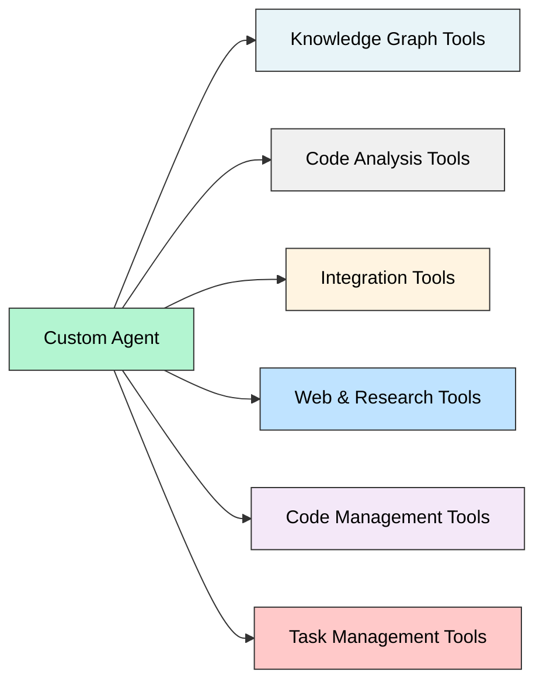

# Tools Reference

Custom agents access 60+ specialized tools across six categories: Knowledge Graph, Code Analysis, Integration Tools, Web & Research, Code Management, and Task Management.

<Info>
  Tools are organized by category. Click on any tool name to see detailed documentation including parameters, return values, and usage examples.
</Info>

## Tool Categories

## Tool Categories Overview

<CardGroup cols={3}>
  <Card title="Knowledge Graph Tools" icon="sitemap" href="#knowledge-graph-tools">
    Query and traverse the code knowledge graph
  </Card>
  <Card title="Code Query Tools" icon="file-code" href="#code-query-tools">
    Retrieve and analyze code structure
  </Card>
  <Card title="Code Changes Tools" icon="code-compare" href="#code-changes-management-tools">
    Manage code modifications (Code Agent only)
  </Card>
  <Card title="Integration Tools" icon="plug" href="#integration-tools">
    Interface with external services
  </Card>
  <Card title="Web Tools" icon="globe" href="#web-tools">
    Web search and external data retrieval
  </Card>
</CardGroup>

## Agent Tool Mapping

<Tabs>
  <Tab title="Ask Agent">
    **19 Tools Total**

    <AccordionGroup>
      <Accordion title="Knowledge Graph Tools (8)" icon="sitemap">
        - [Fuzzy Search](/custom-agents/tools/get_code_from_probable_node_name)
        - [Node Lookup](/custom-agents/tools/get_code_from_node_id)
        - [Batch Fetch](/custom-agents/tools/get_code_from_multiple_node_ids)
        - [Graph Query](/custom-agents/tools/ask_knowledge_graph_queries)
        - [Tag Filter](/custom-agents/tools/get_nodes_from_tags)
        - [Name Lookup](/custom-agents/tools/get_code_from_node_name)
        - [Graph Structure](/custom-agents/tools/get_code_graph_from_node_id)
        - [Name Graph](/custom-agents/tools/get_code_graph_from_node_name)
      </Accordion>
      <Accordion title="Code Query Tools (3)" icon="file-code">
        - get_code_file_structure
        - fetch_file
        - analyze_code_structure
      </Accordion>
      <Accordion title="Web Tools (2)" icon="globe">
        - web_search_tool
        - webpage_extractor
      </Accordion>
      <Accordion title="Task Management Tools (8)" icon="list-check">
        - create_todo
        - update_todo_status
        - get_todo
        - list_todos
        - add_todo_note
        - get_todo_summary
        - add_requirements
        - get_requirements
      </Accordion>
      <Accordion title="Execution Tools (1)" icon="terminal">
        - bash_command
      </Accordion>
    </AccordionGroup>
  </Tab>

  <Tab title="Code Agent">
    **38 Tools Total** (Highest tool count)

    <AccordionGroup>
      <Accordion title="All Ask Agent Tools (20)" icon="sitemap">
        The Code Agent includes all 20 tools from the Ask Agent, plus 18 unique code management tools below.
      </Accordion>
      <Accordion title="Code Changes Management (18)" icon="code-compare">
        **Session-Based Change Tracking** (Code Agent Exclusive)
        - add_file_to_changes
        - update_file_in_changes
        - delete_file_in_changes
        - update_file_lines
        - replace_in_file
        - insert_lines
        - delete_lines
        - get_file_from_changes
        - list_files_in_changes
        - search_content_in_changes
        - clear_file_from_changes
        - clear_all_changes
        - get_changes_summary
        - export_changes
        - show_updated_file
        - show_diff
        - get_file_diff
        - get_session_metadata
      </Accordion>
      <Accordion title="Unique Tracking Tool (1)" icon="list">
        - delete_requirements - Only Code Agent can delete requirements
      </Accordion>
    </AccordionGroup>
  </Tab>

  <Tab title="Debug Agent">
    **19 Tools Total**

    <AccordionGroup>
      <Accordion title="Same as Ask Agent" icon="sitemap">
        The Debug Agent uses the exact same 19 tools as the Ask Agent, but applies them methodically through the 8-step debugging process. See the Ask Agent tab for the complete list.
      </Accordion>
    </AccordionGroup>
  </Tab>
</Tabs>

## Knowledge Graph Tools

Tools for querying and traversing Potpie's code knowledge graph. These tools enable semantic code search and relationship discovery.

<AccordionGroup>
  <Accordion title="Fuzzy Search">
    `get_code_from_probable_node_name` - Search for nodes with probable matches to a given name.

    **Parameters:** `name` (string), `project_id` (string)

    **Returns:** Code content and metadata for matching nodes
  </Accordion>
  <Accordion title="Node Lookup">
    `get_code_from_node_id` - Fetch exact code content using a specific node ID.

    **Parameters:** `node_id` (string)

    **Returns:** Complete code content, file path, and node metadata
  </Accordion>
  <Accordion title="Batch Fetch">
    `get_code_from_multiple_node_ids` - Retrieve code from multiple node IDs simultaneously.

    **Parameters:** `node_ids` (string[])

    **Returns:** Array of code contents and metadata for each node
  </Accordion>
  <Accordion title="Graph Query">
    `ask_knowledge_graph_queries` - Execute natural language or structured queries against the knowledge graph.

    **Parameters:** `query` (string), `project_id` (string)

    **Returns:** Matching nodes, relationships, and relevance scores
  </Accordion>
  <Accordion title="Tag Filter">
    `get_nodes_from_tags` - Retrieve code nodes filtered by specific tags or labels.

    **Parameters:** `tags` (string[]), `project_id` (string)

    **Returns:** Nodes matching the specified tags
  </Accordion>
</AccordionGroup>

## Code Query Tools

Tools for retrieving code structure, file contents, and analyzing relationships.

<AccordionGroup>
  <Accordion title="get_code_file_structure">
    Get the complete directory structure and file organization of the project.

    **Parameters:**
    - `project_id` (string, required) - Project to retrieve structure for
    - `path` (string, optional) - Specific path to get structure for (returns full tree if omitted)

    **Returns:** Hierarchical file and directory structure

    **Use Cases:**
    - Navigate unfamiliar codebases
    - Locate configuration files
    - Understand project organization
    - Find specific directories or file types
  </Accordion>
  <Accordion title="fetch_file">
    Read file contents with line numbers.

    **Parameters:**
    - `file_path` (string, required) - Path to the file to read
    - `project_id` (string, required) - Project containing the file

    **Returns:** File contents with line numbers

    **Use Cases:**
    - Examine specific files
    - Read configuration or source files
    - Get context around specific code locations
  </Accordion>
  <Accordion title="analyze_code_structure">
    Extract classes, functions, and structure from code files.

    **Parameters:**
    - `file_path` (string, required) - File to analyze
    - `project_id` (string, required) - Project containing the file

    **Returns:** Structured representation of code elements (classes, functions, imports, etc.)

    **Use Cases:**
    - Understand file organization
    - Map code structure
    - Identify code elements without reading full file
  </Accordion>
</AccordionGroup>

## Code Changes Management Tools

**Available exclusively to Code Agent.** These tools manage code modifications through a Redis-backed session system with 24-hour expiration.

<AccordionGroup>
  <Accordion title="add_file_to_changes">
    Create a new file in the session.

    **Parameters:**
    - `file_path` (string, required) - Path for new file
    - `content` (string, required) - File content

    **Returns:** Confirmation with file path
  </Accordion>
  <Accordion title="update_file_in_changes">
    Replace entire file content.

    **Parameters:**
    - `file_path` (string, required) - File to update
    - `new_content` (string, required) - New file content

    **Returns:** Update confirmation
  </Accordion>
  <Accordion title="delete_file_in_changes">
    Mark a file for deletion.

    **Parameters:**
    - `file_path` (string, required) - File to delete

    **Returns:** Deletion confirmation
  </Accordion>
  <Accordion title="update_file_lines">
    Modify specific line ranges in a file.

    **Parameters:**
    - `file_path` (string, required) - File to modify
    - `start_line` (integer, required) - Starting line number
    - `end_line` (integer, required) - Ending line number
    - `new_content` (string, required) - Replacement content

    **Returns:** Update confirmation
  </Accordion>
  <Accordion title="replace_in_file">
    Find and replace text with regex support.

    **Parameters:**
    - `file_path` (string, required) - File to modify
    - `pattern` (string, required) - Search pattern (regex)
    - `replacement` (string, required) - Replacement text

    **Returns:** Count of replacements made
  </Accordion>
  <Accordion title="insert_lines">
    Add lines at a specific position.

    **Parameters:**
    - `file_path` (string, required) - File to modify
    - `line_number` (integer, required) - Position to insert at
    - `content` (string, required) - Content to insert

    **Returns:** Insertion confirmation
  </Accordion>
  <Accordion title="delete_lines">
    Remove specific line ranges.

    **Parameters:**
    - `file_path` (string, required) - File to modify
    - `start_line` (integer, required) - First line to delete
    - `end_line` (integer, required) - Last line to delete

    **Returns:** Deletion confirmation
  </Accordion>
  <Accordion title="get_file_from_changes">
    Retrieve current content of a file from the session.

    **Parameters:**
    - `file_path` (string, required) - File to retrieve

    **Returns:** Current file content (including pending changes)
  </Accordion>
  <Accordion title="list_files_in_changes">
    List all files modified in the current session.

    **Returns:** List of file paths with change types (added, modified, deleted)
  </Accordion>
  <Accordion title="search_content_in_changes">
    Search across all modified files in the session.

    **Parameters:**
    - `query` (string, required) - Search query
    - `regex` (boolean, optional) - Use regex matching

    **Returns:** Matching results with file paths and line numbers
  </Accordion>
  <Accordion title="clear_file_from_changes">
    Revert changes for a specific file.

    **Parameters:**
    - `file_path` (string, required) - File to revert

    **Returns:** Revert confirmation
  </Accordion>
  <Accordion title="clear_all_changes">
    Clear all changes in the current session.

    **Returns:** Clear confirmation
  </Accordion>
  <Accordion title="get_changes_summary">
    Get overview of all modifications in the session.

    **Returns:** Summary including file count, line changes, change types
  </Accordion>
  <Accordion title="export_changes">
    Generate patch file or changeset for applying modifications.

    **Parameters:**
    - `format` (string, default: patch) - Export format: patch, json, or git

    **Returns:** Formatted changeset ready for application
  </Accordion>
  <Accordion title="show_updated_file">
    View a file with all changes applied.

    **Parameters:**
    - `file_path` (string, required) - File to view

    **Returns:** Complete file content with changes applied
  </Accordion>
  <Accordion title="show_diff">
    Display unified diff for all pending changes.

    **Parameters:**
    - `file_path` (string, optional) - Specific file to show diff for (shows all if omitted)

    **Returns:** Unified diff output
  </Accordion>
  <Accordion title="get_file_diff">
    Get diff for a specific file.

    **Parameters:**
    - `file_path` (string, required) - File to get diff for

    **Returns:** Line-by-line diff for the file
  </Accordion>
  <Accordion title="get_session_metadata">
    Get session information and statistics.

    **Returns:** Session ID, conversation ID, file count, created/updated timestamps

    All changes are stored in Redis with 24-hour expiration. Export before session expires.
  </Accordion>
</AccordionGroup>

## Integration Tools

Tools for interfacing with external services and detecting code changes.

<AccordionGroup>
  <Accordion title="change_detection">
    Detect code changes between branches or commits in your repository.

    **Parameters:**
    - `base_branch` (string, default: main) - Base branch to compare against
    - `target_branch` (string, optional) - Branch or commit to compare (defaults to current)
    - `project_id` (string, required) - Project to analyze

    **Returns:** Changed files with diff information and impact analysis

    **Use Cases:**
    - Review pull request changes
    - Analyze blast radius of modifications
    - Identify affected code components
    - Detect breaking changes
  </Accordion>
</AccordionGroup>

## Web Tools

External web search and data retrieval tools.

<AccordionGroup>
  <Accordion title="web_search_tool">
    Search external documentation and resources.

    **Parameters:**
    - `query` (string, required) - Search query
    - `num_results` (integer, default: 5) - Number of results to return

    **Returns:** Search results with titles, URLs, and snippets

    **Use Cases:**
    - Search framework documentation
    - Find external resources
    - Research best practices
  </Accordion>
  <Accordion title="webpage_extractor">
    Extract content from web pages.

    **Parameters:**
    - `url` (string, required) - URL to extract content from

    **Returns:** Extracted text content and metadata

    **Use Cases:**
    - Read framework documentation
    - Extract API documentation
    - Get content from specific URLs
  </Accordion>
</AccordionGroup>

## Execution Tools

<AccordionGroup>
  <Accordion title="bash_command">
    Execute read-only shell commands.

    **Parameters:**
    - `command` (string, required) - Shell command to execute

    **Returns:** Command output

    Agents can only run **read-only** commands. Cannot modify files or execute destructive operations.

    **Use Cases:**
    - Check git status
    - List files
    - Get system information
    - Run read-only diagnostics
  </Accordion>
</AccordionGroup>

