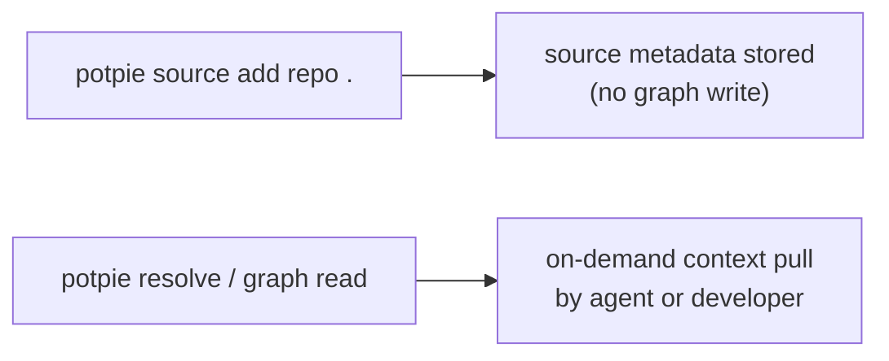

Potpie uses **pots** as workspace or tenant boundaries. Sources are then registered against a pot.

This is the part of the CLI that controls where context lives and which repository or external system belongs to that context boundary.

## Top-Level Alias: `potpie use`

```bash
potpie use [OPTIONS] REF
```

Top-level alias for `potpie pot use`.

| Option | Type | Description |
| --- | --- | --- |
| `--local` | `bool` | Force local-origin pot selection. |
| `--managed` | `bool` | Select a managed-origin pot. |

## `potpie pot`

```bash
potpie pot COMMAND [ARGS]...
```

### Core Pot Commands

| Command | Purpose |
| --- | --- |
| `potpie pot list` | List available pots. |
| `potpie pot info` | Show the active pot. |
| `potpie pot create <name>` | Create a new pot. |
| `potpie pot use <ref>` | Make a pot active. |
| `potpie pot linked --repo current` | Show pots linked to a repo and any repo-local default. |
| `potpie pot rename <ref> <new-name>` | Rename a pot. |
| `potpie pot reset [ref] --confirm` | Reset graph state for a pot. |
| `potpie pot archive <ref>` | Archive a pot. |

### Important Options

`potpie pot list`

| Option | Description |
| --- | --- |
| `--local` | Local-origin pots only. |
| `--managed` | Managed-origin pots only. |
| `--all` | Show local and managed pots together. |

`potpie pot create`

| Option | Description |
| --- | --- |
| `--repo` | Associate a repository at creation time. |
| `--use` | Make the new pot active immediately. |

## Repo-Local Defaults

```bash
potpie pot default COMMAND
```

Repo-local defaults let a repository resolve to the right pot automatically.

| Command | Purpose |
| --- | --- |
| `potpie pot default show --repo current` | Show the repo-local default pot. |
| `potpie pot default set <ref> --repo current` | Bind a repo to a default pot. |
| `potpie pot default clear --repo current` | Remove the repo-local default binding. |

## Source Registration

```bash
potpie source COMMAND
```

### Important model

`potpie source add` **registers metadata only**. It does not ingest, parse, or scan by itself.

The diagram below shows how context enters the graph:



<Note>
`source add` registers a repository once; context is pulled when agents or developers actually need it.
</Note>

### Source commands

| Command | Purpose |
| --- | --- |
| `potpie source add <kind> <location>` | Register a source record. |
| `potpie source list` | List sources for a pot. |
| `potpie source status <source_id>` | Inspect one source record. |
| `potpie source remove <source_id>` | Remove a source record. |

### `potpie source add`

```bash
potpie source add [OPTIONS] KIND LOCATION
```

| Parameter | Type | Description |
| --- | --- | --- |
| `kind` | `str` | Source type, such as `repo`, `github`, or `document`. |
| `location` | `str` | Path, `owner/repo`, URL, or integration-specific source location. |

| Option | Type | Description |
| --- | --- | --- |
| `--name` | `str` | Optional display name for the source. |
| `--pot` | `str` | Pot to register against. |
| `--default` / `--no-default` | `bool` | For repo sources, set or skip repo-local default routing. |

Examples:

```bash
potpie source add repo .
potpie source add github potpie-ai/potpie
potpie source add document https://internal.wiki/runbook/auth-migration
```

## Ingestion Entry Points

This is where your expectation mattered: ingestion is not a separate generic `ingest` top-level command.

Instead, ingestion shows up in **pot-attached external-system workflows**:

### Linear team sync

```bash
potpie pot linear-team diff-sync TEAM
```

| Command | Purpose |
| --- | --- |
| `diff-sync` | Queue an incremental graph-audit diff sync for a Linear team. |

### Jira project sync

```bash
potpie pot jira-project diff-sync PROJECT
```

| Command | Purpose |
| --- | --- |
| `diff-sync` | Queue incremental Jira project diff-sync into a pot. |

## Recommended Workspace Flow

```bash
potpie pot list
potpie pot create my-repo --repo . --use
potpie source add repo . --default
potpie pot linked --repo current
```
