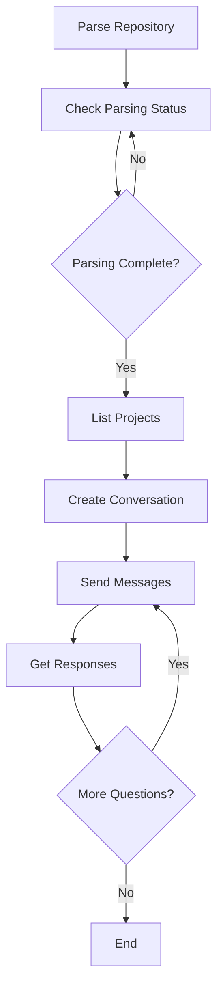

## Welcome to Potpie API

The Potpie API enables you to integrate AI-powered codebase intelligence into your applications, tools, and workflows. Our REST API provides programmatic access to all of Potpie's core features including parsing, conversations, search, and agent interactions.

<CardGroup cols={2}>
  <Card
    title="Quick Start"
    icon="rocket"
    href="#getting-started"
  >
    Get up and running in minutes
  </Card>
  <Card
    title="Authentication"
    icon="key"
    href="#authentication"
  >
    Learn how to authenticate your requests
  </Card>
  <Card
    title="Code Examples"
    icon="code"
    href="#code-examples"
  >
    Copy-paste ready examples in multiple languages
  </Card>
  <Card
    title="API Endpoints"
    icon="book"
    href="#available-endpoints"
  >
    Browse all 10 available endpoints
  </Card>
</CardGroup>

## Getting Started

### Base URL

All API requests should be made to:

```
https://production-api.potpie.ai
```

### API Key

Get your API key from the [Potpie Dashboard](https://app.potpie.ai/settings/api-keys).

<Warning>
  Keep your API key secure! Never commit it to version control or expose it in client-side code.
</Warning>

### Making Your First Request

```bash
curl -X GET \
  'https://production-api.potpie.ai/api/v1/projects/list' \
  -H 'Authorization: Bearer YOUR_API_KEY'
```

## Authentication

All API endpoints require authentication using Bearer tokens. Include your API key in the `Authorization` header of every request:

```
Authorization: Bearer YOUR_API_KEY
```

### Example Authentication

<CodeGroup>

```typescript TypeScript
const response = await fetch('https://production-api.potpie.ai/api/v1/projects/list', {
  headers: {
    'Authorization': `Bearer ${process.env.POTPIE_API_KEY}`,
    'Content-Type': 'application/json'
  }
});
```

```python Python
import requests
import os

response = requests.get(
    'https://production-api.potpie.ai/api/v1/projects/list',
    headers={
        'Authorization': f'Bearer {os.environ["POTPIE_API_KEY"]}',
        'Content-Type': 'application/json'
    }
)
```

```bash cURL
curl -X GET \
  'https://production-api.potpie.ai/api/v1/projects/list' \
  -H 'Authorization: Bearer YOUR_API_KEY' \
  -H 'Content-Type: application/json'
```

</CodeGroup>

### Security Best Practices

- Store API keys in environment variables
- Use different keys for development and production
- Rotate keys periodically
- Never log or print API keys
- Implement proper error handling to avoid exposing keys

## Available Endpoints

### Parsing & Projects

<CardGroup cols={2}>
  <Card
    title="Parse Directory"
    icon="folder-tree"
    href="/api-reference/endpoint/parse-directory"
  >
    POST /api/v1/parse - Analyze a repository to build the knowledge graph
  </Card>
  <Card
    title="Get Parsing Status"
    icon="spinner"
    href="/api-reference/endpoint/get-parsing-status"
  >
    GET /api/v1/parsing-status/:project_id - Check parsing progress
  </Card>
  <Card
    title="Get Parsing Status By Repo"
    icon="code-branch"
    href="/api-reference/endpoint/get-parsing-status-by-repo"
  >
    POST /api/v1/parsing-status - Check status using repo name and branch
  </Card>
  <Card
    title="List Projects"
    icon="list"
    href="/api-reference/endpoint/list-projects"
  >
    GET /api/v1/projects/list - Retrieve all your parsed projects
  </Card>
  <Card
    title="Search Codebase"
    icon="magnifying-glass"
    href="/api-reference/endpoint/search-codebase"
  >
    POST /api/v1/search - Perform semantic search across your code
  </Card>
</CardGroup>

### Conversations & Agents

<CardGroup cols={2}>
  <Card
    title="Create Conversation"
    icon="comments"
    href="/api-reference/endpoint/create-conversation"
  >
    POST /api/v2/conversations/ - Start a new conversation with AI agents
  </Card>
  <Card
    title="Post Message"
    icon="message"
    href="/api-reference/endpoint/post-message"
  >
    POST /api/v1/conversations/:id/message/ - Send messages to a conversation
  </Card>
  <Card
    title="Create Conversation And Message"
    icon="bolt"
    href="/api-reference/endpoint/create-conversation-and-message"
  >
    POST /api/v2/project/:project_id/message/ - Quick single-call message flow
  </Card>
  <Card
    title="List Agents"
    icon="robot"
    href="/api-reference/endpoint/list-agents"
  >
    GET /api/v1/list-available-agents/ - Get all available AI agents
  </Card>
</CardGroup>

### Integrations

<CardGroup cols={2}>
  <Card
    title="Save Integration"
    icon="plug"
    href="/api-reference/endpoint/save-integration"
  >
    POST /api/v2/integrations/save - Configure external service integrations
  </Card>
</CardGroup>

## Typical Workflow

Here's a common workflow for using the Potpie API:



### Step-by-Step Integration

<Steps>
  <Step title="Parse Your Repository">
    Use the [Parse Directory](/api-reference/endpoint/parse-directory) endpoint to analyze your codebase and build the knowledge graph
  </Step>
  <Step title="Monitor Parsing">
    Poll the [Get Parsing Status](/api-reference/endpoint/get-parsing-status) endpoint until parsing is complete
  </Step>
  <Step title="Select an Agent">
    Use [List Agents](/api-reference/endpoint/list-agents) to see available AI agents and choose the right one for your task
  </Step>
  <Step title="Create Conversation">
    Start a conversation with [Create Conversation](/api-reference/endpoint/create-conversation) by providing project IDs and agent IDs
  </Step>
  <Step title="Interact">
    Send messages using [Post Message](/api-reference/endpoint/post-message) and receive AI-powered responses about your codebase
  </Step>
</Steps>

## Code Examples

### Complete Integration Example

<CodeGroup>

```typescript Complete TypeScript Example
import fetch from 'node-fetch';

interface PotpieConfig {
  apiKey: string;
  baseUrl?: string;
}

class PotpieClient {
  private apiKey: string;
  private baseUrl: string;

  constructor(config: PotpieConfig) {
    this.apiKey = config.apiKey;
    this.baseUrl = config.baseUrl || 'https://production-api.potpie.ai';
  }

  private async request(endpoint: string, options: RequestInit = {}) {
    const response = await fetch(`${this.baseUrl}${endpoint}`, {
      ...options,
      headers: {
        'Authorization': `Bearer ${this.apiKey}`,
        'Content-Type': 'application/json',
        ...options.headers,
      },
    });

    if (!response.ok) {
      throw new Error(`API Error: ${response.status} ${response.statusText}`);
    }

    return response.json();
  }

  // 1. Parse a repository
  async parseDirectory(data: {
    repo_name?: string;
    repo_path?: string;
    branch_name: string;
  }) {
    return this.request('/api/v1/parse', {
      method: 'POST',
      body: JSON.stringify(data),
    });
  }

  // 2. Check parsing status
  async getParsingStatus(projectId: string) {
    return this.request(`/api/v1/parsing-status/${projectId}`);
  }

  // 3. Wait for parsing to complete
  async waitForParsing(projectId: string, pollInterval = 5000) {
    while (true) {
      const status = await this.getParsingStatus(projectId);

      console.log(`Status: ${status.status} - ${status.progress}%`);

      if (status.status === 'completed') {
        return status;
      }

      if (status.status === 'failed') {
        throw new Error(`Parsing failed: ${status.error}`);
      }

      await new Promise(resolve => setTimeout(resolve, pollInterval));
    }
  }

  // 4. List all projects
  async listProjects() {
    return this.request('/api/v1/projects/list');
  }

  // 5. List available agents
  async listAgents() {
    return this.request('/api/v1/list-available-agents/');
  }

  // 6. Create a conversation
  async createConversation(data: {
    user_id: string;
    title: string;
    status: string;
    project_ids: string[];
    agent_ids: string[];
  }) {
    return this.request('/api/v1/conversations/', {
      method: 'POST',
      body: JSON.stringify(data),
    });
  }

  // 7. Send a message
  async postMessage(conversationId: string, content: string, nodeIds?: any[]) {
    return this.request(`/api/v1/conversations/${conversationId}/message/`, {
      method: 'POST',
      body: JSON.stringify({ content, node_ids: nodeIds }),
    });
  }

  // 8. Search codebase
  async searchCodebase(projectId: string, query: string) {
    return this.request('/api/v1/search', {
      method: 'POST',
      body: JSON.stringify({ project_id: projectId, query }),
    });
  }
}

// Usage example
async function main() {
  const client = new PotpieClient({
    apiKey: process.env.POTPIE_API_KEY!,
  });

  try {
    // Parse repository
    console.log('Starting repository parsing...');
    const parseResponse = await client.parseDirectory({
      repo_name: 'my-awesome-app',
      repo_path: '/path/to/repo',
      branch_name: 'main',
    });

    const projectId = parseResponse.project_id;
    console.log(`Project ID: ${projectId}`);

    // Wait for parsing to complete
    await client.waitForParsing(projectId);
    console.log('Parsing completed!');

    // List available agents
    const agents = await client.listAgents();
    console.log('Available agents:', agents);

    // Create conversation
    const conversation = await client.createConversation({
      user_id: 'user_123',
      title: 'Code Review Session',
      status: 'active',
      project_ids: [projectId],
      agent_ids: ['qna-agent'],
    });

    console.log(`Conversation ID: ${conversation.conversation_id}`);

    // Ask a question
    await client.postMessage(
      conversation.conversation_id,
      'How does authentication work in this codebase?'
    );

    console.log('Message sent successfully!');
  } catch (error) {
    console.error('Error:', error);
  }
}

main();
```

```python Complete Python Example
import os
import time
import requests
from typing import Optional, Dict, List, Any

class PotpieClient:
    def __init__(self, api_key: str, base_url: str = "https://production-api.potpie.ai"):
        self.api_key = api_key
        self.base_url = base_url
        self.session = requests.Session()
        self.session.headers.update({
            'Authorization': f'Bearer {api_key}',
            'Content-Type': 'application/json'
        })

    def _request(self, method: str, endpoint: str, **kwargs) -> Dict[str, Any]:
        url = f"{self.base_url}{endpoint}"
        response = self.session.request(method, url, **kwargs)
        response.raise_for_status()
        return response.json()

    # 1. Parse a repository
    def parse_directory(self, branch_name: str, repo_name: Optional[str] = None,
                       repo_path: Optional[str] = None) -> Dict[str, Any]:
        data = {
            'branch_name': branch_name,
            'repo_name': repo_name,
            'repo_path': repo_path
        }
        return self._request('POST', '/api/v1/parse', json=data)

    # 2. Check parsing status
    def get_parsing_status(self, project_id: str) -> Dict[str, Any]:
        return self._request('GET', f'/api/v1/parsing-status/{project_id}')

    # 3. Wait for parsing to complete
    def wait_for_parsing(self, project_id: str, poll_interval: int = 5) -> Dict[str, Any]:
        while True:
            status = self.get_parsing_status(project_id)

            print(f"Status: {status['status']} - {status.get('progress', 0)}%")

            if status['status'] == 'completed':
                return status

            if status['status'] == 'failed':
                raise Exception(f"Parsing failed: {status.get('error')}")

            time.sleep(poll_interval)

    # 4. List all projects
    def list_projects(self) -> Dict[str, Any]:
        return self._request('GET', '/api/v1/projects/list')

    # 5. List available agents
    def list_agents(self) -> List[Dict[str, Any]]:
        return self._request('GET', '/api/v1/list-available-agents/')

    # 6. Create a conversation
    def create_conversation(self, user_id: str, title: str, project_ids: List[str],
                          agent_ids: List[str], status: str = 'active') -> Dict[str, Any]:
        data = {
            'user_id': user_id,
            'title': title,
            'status': status,
            'project_ids': project_ids,
            'agent_ids': agent_ids
        }
        return self._request('POST', '/api/v1/conversations/', json=data)

    # 7. Send a message
    def post_message(self, conversation_id: str, content: str,
                    node_ids: Optional[List[Dict]] = None) -> Dict[str, Any]:
        data = {
            'content': content,
            'node_ids': node_ids
        }
        return self._request('POST', f'/api/v1/conversations/{conversation_id}/message/', json=data)

    # 8. Search codebase
    def search_codebase(self, project_id: str, query: str) -> Dict[str, Any]:
        data = {
            'project_id': project_id,
            'query': query
        }
        return self._request('POST', '/api/v1/search', json=data)


def main():
    # Initialize client
    client = PotpieClient(api_key=os.environ['POTPIE_API_KEY'])

    try:
        # Parse repository
        print('Starting repository parsing...')
        parse_response = client.parse_directory(
            repo_name='my-awesome-app',
            repo_path='/path/to/repo',
            branch_name='main'
        )

        project_id = parse_response['project_id']
        print(f'Project ID: {project_id}')

        # Wait for parsing to complete
        client.wait_for_parsing(project_id)
        print('Parsing completed!')

        # List available agents
        agents = client.list_agents()
        print(f'Available agents: {len(agents)}')
        for agent in agents:
            print(f"  - {agent['name']}: {agent['description']}")

        # Create conversation
        conversation = client.create_conversation(
            user_id='user_123',
            title='Code Review Session',
            project_ids=[project_id],
            agent_ids=['qna-agent']
        )

        print(f"Conversation ID: {conversation['conversation_id']}")

        # Ask a question
        client.post_message(
            conversation['conversation_id'],
            'How does authentication work in this codebase?'
        )

        print('Message sent successfully!')

        # Search the codebase
        search_results = client.search_codebase(
            project_id=project_id,
            query='authentication functions'
        )

        print(f"Found {len(search_results['results'])} results")
        for result in search_results['results'][:3]:
            print(f"  - {result['name']} in {result['file_path']}")

    except Exception as error:
        print(f'Error: {error}')


if __name__ == '__main__':
    main()
```

</CodeGroup>

## Rate Limits

To ensure fair usage and system stability:

| Resource | Limit |
|----------|-------|
| API Requests | 1000 requests per hour |
| Parsing Jobs | 5 concurrent parsings |
| Message Rate | 10 messages per minute per conversation |
| Search Queries | 100 searches per minute |

<Note>
  Rate limits are subject to your plan. Contact sales@potpie.ai for higher limits.
</Note>

## Error Handling

The API uses standard HTTP status codes:

| Status Code | Description |
|-------------|-------------|
| 200 | Success |
| 400 | Bad Request - Invalid parameters |
| 401 | Unauthorized - Invalid or missing API key |
| 403 | Forbidden - Insufficient permissions |
| 404 | Not Found - Resource doesn't exist |
| 422 | Validation Error - Request body validation failed |
| 429 | Too Many Requests - Rate limit exceeded |
| 500 | Internal Server Error - Something went wrong |

### Error Response Format

```json
{
  "detail": [
    {
      "loc": ["body", "project_id"],
      "msg": "field required",
      "type": "value_error.missing"
    }
  ]
}
```

### Handling Errors

<CodeGroup>

```typescript TypeScript
try {
  const response = await fetch(endpoint, options);

  if (!response.ok) {
    if (response.status === 401) {
      throw new Error('Invalid API key');
    }
    if (response.status === 429) {
      throw new Error('Rate limit exceeded - please wait before retrying');
    }
    if (response.status === 404) {
      throw new Error('Resource not found');
    }
    throw new Error(`API error: ${response.status}`);
  }

  return await response.json();
} catch (error) {
  console.error('API request failed:', error);
  throw error;
}
```

```python Python
import requests

try:
    response = requests.post(endpoint, json=data, headers=headers)
    response.raise_for_status()
    return response.json()

except requests.exceptions.HTTPError as e:
    if e.response.status_code == 401:
        print('Invalid API key')
    elif e.response.status_code == 429:
        print('Rate limit exceeded - please wait before retrying')
    elif e.response.status_code == 404:
        print('Resource not found')
    else:
        print(f'API error: {e}')
    raise

except requests.exceptions.RequestException as e:
    print(f'Request failed: {e}')
    raise
```

```bash cURL
# Check HTTP status code
curl -w "\nHTTP Status: %{http_code}\n" \
  -X GET \
  'https://production-api.potpie.ai/api/v1/projects/list' \
  -H 'Authorization: Bearer YOUR_API_KEY'
```

</CodeGroup>

## Best Practices

### API Usage

1. **Polling**: When checking parsing status, use exponential backoff to reduce unnecessary requests
2. **Caching**: Cache project lists and agent information to minimize API calls
3. **Error Handling**: Implement retry logic with exponential backoff for transient errors
4. **Timeouts**: Set appropriate timeouts for long-running operations
5. **Pagination**: Use pagination parameters when available to handle large result sets

### Security

1. **API Keys**: Store API keys securely in environment variables or secret management systems
2. **HTTPS**: Always use HTTPS for API requests
3. **Key Rotation**: Rotate API keys regularly
4. **Access Control**: Use different API keys for different environments (dev, staging, prod)

### Performance

1. **Batch Operations**: Group related operations when possible
2. **Parallel Requests**: Make independent API calls in parallel
3. **Response Caching**: Cache responses when data doesn't change frequently
4. **Connection Pooling**: Reuse HTTP connections for multiple requests

## SDKs and Libraries

### Official SDKs (Coming Soon)

We're working on official SDKs for:
- TypeScript/JavaScript
- Python
- Go
- Ruby

### Community Libraries

Check out community-contributed libraries on [GitHub](https://github.com/potpie-ai).

## Webhooks (Coming Soon)

Subscribe to events in your codebase:
- Parsing completed
- New conversation created
- Message response ready
- Code changes detected

## Support

Need help?

<CardGroup cols={2}>
  <Card
    title="Documentation"
    icon="book"
    href="https://docs.potpie.ai"
  >
    Browse comprehensive guides
  </Card>
  <Card
    title="Discord Community"
    icon="discord"
    href="https://discord.gg/ryk5CMD5v6"
  >
    Join our developer community
  </Card>
  <Card
    title="GitHub Issues"
    icon="github"
    href="https://github.com/potpie-ai/potpie/issues"
  >
    Report bugs and request features
  </Card>
  <Card
    title="Email Support"
    icon="envelope"
    href="mailto:hi@potpie.ai"
  >
    Contact our support team
  </Card>
</CardGroup>

## API Changelog

Stay updated with the latest API changes:

### 2024-02-09
- Comprehensive API documentation for 10 core endpoints
- Enhanced OpenAPI 3.1 specification with detailed examples
- Improved authentication and error handling documentation
- Added complete integration examples in TypeScript and Python
- Rate limiting and best practices guidelines
- Added integrations endpoint for external service configuration
- Streamlined conversation creation with direct message endpoint

<Note>
  Subscribe to our [API changelog](https://docs.potpie.ai/changelog) for updates.
</Note>
