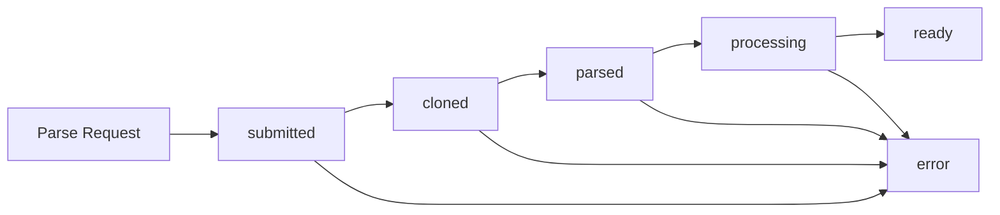

## Overview

Projects represent parsed code repositories that are ready for AI-powered analysis. Each project contains:

- Parsed code structure and AST
- Generated embeddings for semantic search
- Knowledge graph of code relationships
- Metadata about the repository

## List Projects

Get all projects for the authenticated user.

<CodeGroup>

```bash cURL (v1 - Bearer Token)
curl -X GET https://api.potpie.ai/api/v1/projects/list \
  -H "Authorization: Bearer YOUR_TOKEN"
```

```bash cURL (v2 - API Key)
curl -X GET https://api.potpie.ai/api/v2/projects/list \
  -H "x-api-key: YOUR_API_KEY" \
  -H "x-user-id: YOUR_USER_ID"
```

```python Python
import requests

def list_projects(token: str):
    """List all projects using Bearer token"""
    url = "https://api.potpie.ai/api/v1/projects/list"
    headers = {"Authorization": f"Bearer {token}"}

    response = requests.get(url, headers=headers)
    return response.json()

def list_projects_api_key(api_key: str, user_id: str):
    """List all projects using API key"""
    url = "https://api.potpie.ai/api/v2/projects/list"
    headers = {
        "x-api-key": api_key,
        "x-user-id": user_id
    }

    response = requests.get(url, headers=headers)
    return response.json()

# Usage
projects = list_projects("YOUR_TOKEN")
for project in projects:
    print(f"{project['repo_name']} - {project['status']}")
```

```typescript TypeScript
interface Project {
  id: string;
  repo_name: string;
  repo_path?: string;
  branch_name: string;
  commit_id?: string;
  status: 'submitted' | 'cloned' | 'parsed' | 'ready' | 'error';
  user_id: string;
  created_at: string;
  updated_at: string;
  is_deleted: boolean;
}

async function listProjects(token: string): Promise<Project[]> {
  const response = await fetch('https://api.potpie.ai/api/v1/projects/list', {
    headers: {
      'Authorization': `Bearer ${token}`
    }
  });

  return response.json();
}

async function listProjectsApiKey(apiKey: string, userId: string): Promise<Project[]> {
  const response = await fetch('https://api.potpie.ai/api/v2/projects/list', {
    headers: {
      'x-api-key': apiKey,
      'x-user-id': userId
    }
  });

  return response.json();
}
```

```go Go
package main

import (
    "encoding/json"
    "io/ioutil"
    "net/http"
)

type Project struct {
    ID         string `json:"id"`
    RepoName   string `json:"repo_name"`
    RepoPath   string `json:"repo_path,omitempty"`
    BranchName string `json:"branch_name"`
    CommitID   string `json:"commit_id,omitempty"`
    Status     string `json:"status"`
    UserID     string `json:"user_id"`
    CreatedAt  string `json:"created_at"`
    UpdatedAt  string `json:"updated_at"`
    IsDeleted  bool   `json:"is_deleted"`
}

func listProjects(apiKey, userID string) ([]Project, error) {
    req, _ := http.NewRequest("GET", "https://api.potpie.ai/api/v2/projects/list", nil)
    req.Header.Add("x-api-key", apiKey)
    req.Header.Add("x-user-id", userID)

    client := &http.Client{}
    resp, err := client.Do(req)
    if err != nil {
        return nil, err
    }
    defer resp.Body.Close()

    body, _ := ioutil.ReadAll(resp.Body)

    var projects []Project
    json.Unmarshal(body, &projects)

    return projects, nil
}
```

</CodeGroup>

### Response

```json
[
  {
    "id": "proj_01HQXYZ789ABCDEF",
    "repo_name": "facebook/react",
    "repo_path": null,
    "branch_name": "main",
    "commit_id": "abc123def456789",
    "status": "ready",
    "user_id": "user_01HQXYZ789",
    "created_at": "2024-01-15T10:30:00Z",
    "updated_at": "2024-01-15T10:45:00Z",
    "is_deleted": false
  },
  {
    "id": "proj_02HQXYZ123GHIJKL",
    "repo_name": "vuejs/vue",
    "repo_path": null,
    "branch_name": "main",
    "commit_id": null,
    "status": "processing",
    "user_id": "user_01HQXYZ789",
    "created_at": "2024-01-16T14:20:00Z",
    "updated_at": "2024-01-16T14:25:00Z",
    "is_deleted": false
  }
]
```

<ResponseField name="id" type="string">
  Unique project identifier
</ResponseField>

<ResponseField name="repo_name" type="string">
  Repository name (e.g., "facebook/react" for GitHub)
</ResponseField>

<ResponseField name="repo_path" type="string" nullable>
  Local filesystem path (if applicable)
</ResponseField>

<ResponseField name="branch_name" type="string">
  Git branch name
</ResponseField>

<ResponseField name="commit_id" type="string" nullable>
  Specific commit SHA (if provided during parsing)
</ResponseField>

<ResponseField name="status" type="string">
  Current project status:
  - `submitted`: Parsing queued
  - `cloned`: Repository cloned
  - `parsed`: Code parsed
  - `ready`: Fully indexed and ready
  - `error`: Parsing failed
</ResponseField>

<ResponseField name="user_id" type="string">
  Owner user ID
</ResponseField>

<ResponseField name="created_at" type="string">
  ISO 8601 timestamp when project was created
</ResponseField>

<ResponseField name="updated_at" type="string">
  ISO 8601 timestamp when project was last updated
</ResponseField>

<ResponseField name="is_deleted" type="boolean">
  Whether the project has been soft-deleted
</ResponseField>

## Delete Project

Delete a project and all associated data.

<CodeGroup>

```bash cURL
curl -X DELETE "https://api.potpie.ai/api/v1/projects?project_id=proj_01HQXYZ789ABCDEF" \
  -H "Authorization: Bearer YOUR_TOKEN"
```

```python Python
def delete_project(project_id: str, token: str):
    """Delete a project"""
    url = "https://api.potpie.ai/api/v1/projects"
    params = {"project_id": project_id}
    headers = {"Authorization": f"Bearer {token}"}

    response = requests.delete(url, params=params, headers=headers)
    return response.json()

# Usage
result = delete_project("proj_01HQXYZ789ABCDEF", "YOUR_TOKEN")
print(result['message'])
```

```typescript TypeScript
async function deleteProject(projectId: string, token: string) {
  const response = await fetch(
    `https://api.potpie.ai/api/v1/projects?project_id=${projectId}`,
    {
      method: 'DELETE',
      headers: {
        'Authorization': `Bearer ${token}`
      }
    }
  );

  return response.json();
}

// Usage
const result = await deleteProject('proj_01HQXYZ789ABCDEF', 'YOUR_TOKEN');
console.log(result.message);
```

</CodeGroup>

### Query Parameters

<ParamField query="project_id" type="string" required>
  ID of the project to delete
</ParamField>

### Response

```json
{
  "message": "Project deleted successfully.",
  "id": "proj_01HQXYZ789ABCDEF"
}
```

<Warning>
Deleting a project is irreversible. All associated data including conversations, embeddings, and knowledge graphs will be permanently deleted.
</Warning>

## Project Lifecycle

Understanding project states and transitions:



### Status Descriptions

<AccordionGroup>
  <Accordion title="submitted" icon="paper-plane">
    Parsing request has been received and queued. The repository will be cloned shortly.

    **Typical Duration:** Instant
  </Accordion>

  <Accordion title="cloned" icon="download">
    Repository has been successfully cloned from GitHub or accessed locally.

    **Typical Duration:** 30 seconds - 3 minutes
  </Accordion>

  <Accordion title="parsed" icon="code">
    Code structure has been analyzed and AST (Abstract Syntax Tree) generated.

    **Typical Duration:** 1-5 minutes
  </Accordion>

  <Accordion title="processing" icon="brain">
    Embeddings are being generated and knowledge graph is being constructed.

    **Typical Duration:** 2-10 minutes
  </Accordion>

  <Accordion title="ready" icon="check">
    Project is fully indexed and ready for AI-powered analysis. You can now:
    - Create conversations
    - Search the codebase
    - Ask questions
    - Generate code

    **This is the final state for successful parsing**
  </Accordion>

  <Accordion title="error" icon="exclamation-triangle">
    Parsing failed. Check the error message for details. Common causes:
    - Repository is private and credentials are missing
    - Repository is too large
    - Unsupported file types
    - Network issues
  </Accordion>
</AccordionGroup>

## Examples

### Find Ready Projects

```python
def get_ready_projects(token: str):
    """Get all projects that are ready to use"""
    projects = list_projects(token)
    ready_projects = [p for p in projects if p['status'] == 'ready']
    return ready_projects

# Usage
ready = get_ready_projects("YOUR_TOKEN")
for project in ready:
    print(f"✓ {project['repo_name']} is ready")
```

### Monitor Multiple Projects

```python
import time

def monitor_projects(project_ids: list, token: str, check_interval: int = 30):
    """Monitor multiple projects until all are ready"""
    pending = set(project_ids)

    while pending:
        projects = list_projects(token)
        project_dict = {p['id']: p for p in projects}

        for project_id in list(pending):
            project = project_dict.get(project_id)

            if not project:
                print(f"⚠️ Project {project_id} not found")
                pending.remove(project_id)
                continue

            status = project['status']

            if status == 'ready':
                print(f"✓ {project['repo_name']} is ready")
                pending.remove(project_id)
            elif status == 'error':
                print(f"✗ {project['repo_name']} failed")
                pending.remove(project_id)
            else:
                print(f"⏳ {project['repo_name']}: {status}")

        if pending:
            time.sleep(check_interval)

    print("All projects processed!")

# Usage
monitor_projects([
    "proj_01HQXYZ789ABCDEF",
    "proj_02HQXYZ123GHIJKL"
], "YOUR_TOKEN")
```

### Project Metadata

```python
def get_project_info(project_id: str, token: str):
    """Get detailed information about a project"""
    projects = list_projects(token)
    project = next((p for p in projects if p['id'] == project_id), None)

    if not project:
        return None

    # Calculate age
    from datetime import datetime
    created = datetime.fromisoformat(project['created_at'].replace('Z', '+00:00'))
    age = (datetime.now(created.tzinfo) - created).days

    return {
        "id": project['id'],
        "name": project['repo_name'],
        "branch": project['branch_name'],
        "status": project['status'],
        "age_days": age,
        "is_local": project['repo_path'] is not None,
        "has_specific_commit": project['commit_id'] is not None
    }

# Usage
info = get_project_info("proj_01HQXYZ789ABCDEF", "YOUR_TOKEN")
print(f"Project: {info['name']}")
print(f"Status: {info['status']}")
print(f"Age: {info['age_days']} days")
```

### Bulk Delete Projects

```python
def bulk_delete_projects(project_ids: list, token: str):
    """Delete multiple projects"""
    results = []

    for project_id in project_ids:
        try:
            result = delete_project(project_id, token)
            results.append({
                "project_id": project_id,
                "success": True,
                "message": result['message']
            })
            print(f"✓ Deleted {project_id}")
        except Exception as e:
            results.append({
                "project_id": project_id,
                "success": False,
                "error": str(e)
            })
            print(f"✗ Failed to delete {project_id}: {e}")

    return results

# Usage - be careful!
to_delete = ["proj_old_123", "proj_old_456"]
results = bulk_delete_projects(to_delete, "YOUR_TOKEN")
```

## Filtering and Sorting

```python
def filter_projects(token: str, **filters):
    """Filter projects by various criteria"""
    projects = list_projects(token)

    # Apply filters
    if 'status' in filters:
        projects = [p for p in projects if p['status'] == filters['status']]

    if 'repo_name' in filters:
        projects = [p for p in projects if filters['repo_name'] in p['repo_name']]

    if 'branch' in filters:
        projects = [p for p in projects if p['branch_name'] == filters['branch']]

    if 'is_local' in filters:
        has_path = lambda p: p['repo_path'] is not None
        projects = [p for p in projects if has_path(p) == filters['is_local']]

    # Sort by updated_at (most recent first)
    projects.sort(key=lambda p: p['updated_at'], reverse=True)

    return projects

# Usage examples
ready_projects = filter_projects("YOUR_TOKEN", status="ready")
react_projects = filter_projects("YOUR_TOKEN", repo_name="react")
local_projects = filter_projects("YOUR_TOKEN", is_local=True)
main_branch = filter_projects("YOUR_TOKEN", branch="main")
```

## Integration with Other APIs

### Parse and Use Project

```python
def parse_and_wait(repo_name: str, branch: str, token: str):
    """Parse a repo and wait until ready, then return project info"""
    # Start parsing
    parse_response = requests.post(
        "https://api.potpie.ai/api/v1/parse",
        headers={"Authorization": f"Bearer {token}"},
        json={"repo_name": repo_name, "branch_name": branch}
    )
    project_id = parse_response.json()['project_id']

    # Wait for completion
    while True:
        status_response = requests.get(
            f"https://api.potpie.ai/api/v1/parsing-status/{project_id}",
            headers={"Authorization": f"Bearer {token}"}
        )
        status = status_response.json()

        if status['status'] == 'ready':
            break
        elif status['status'] == 'error':
            raise Exception(f"Parsing failed: {status.get('error')}")

        time.sleep(10)

    # Get project details
    projects = list_projects(token)
    project = next(p for p in projects if p['id'] == project_id)

    return project

# Usage
project = parse_and_wait("facebook/react", "main", "YOUR_TOKEN")
print(f"Project {project['id']} is ready!")
```

## Best Practices

<CardGroup cols={2}>
  <Card title="Regular Cleanup" icon="trash">
    Delete old or unused projects to stay within storage limits
  </Card>

  <Card title="Monitor Status" icon="chart-line">
    Check project status before using in conversations or searches
  </Card>

  <Card title="Branch Strategy" icon="code-branch">
    Parse main/stable branches for production use
  </Card>

  <Card title="Reparse Strategy" icon="rotate">
    Only reparse when significant changes occur (>100 commits)
  </Card>
</CardGroup>

## Troubleshooting

<AccordionGroup>
  <Accordion title="Project stuck in 'processing' status">
    If a project remains in 'processing' for more than 1 hour:
    1. Check the parsing status endpoint for error details
    2. Verify the repository size is supported (under 100K files)
    3. Contact support if the issue persists
  </Accordion>

  <Accordion title="Cannot find my project">
    Ensure:
    - You're using the correct authentication credentials
    - The project hasn't been deleted
    - You're the owner of the project
  </Accordion>

  <Accordion title="Project status is 'error'">
    Common solutions:
    - Verify the repository exists and is accessible
    - Check if you have permissions for private repos
    - Ensure the repository isn't too large
    - Try parsing again with a different branch
  </Accordion>
</AccordionGroup>
