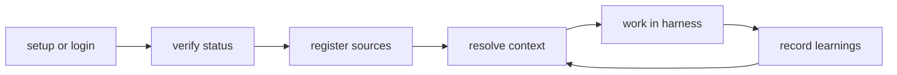

This page covers the common developer workflows you will use day-to-day with Potpie: onboarding a new repository, using context retrieval in your coding sessions, recording project memory, and working with source integrations.

<Note>
If you have not yet installed the CLI and run first-time setup, start with [Installation](/context-engine/installation).
</Note>

## The Core Workflow

Every Potpie session follows the same basic loop:



1. **Setup once** — `potpie setup --repo . --agent claude`
2. **Verify readiness** — `potpie status --host`
3. **Register your repo** — `potpie source add repo .`
4. **Resolve context before working** — `potpie resolve "<task>"`
5. **Work in your harness** — the installed skill handles context calls automatically
6. **Record learnings** — `potpie record --type decision --summary "..."`

## Running the CLI

```bash
potpie [--json] [--verbose] COMMAND [ARGS]...
```

Use `--json` to get machine-readable output for scripting or agent consumption:

```bash
potpie resolve "billing webhook failures" --json | jq '.items'
```

Use `--verbose` or `-v` for full tracebacks when debugging CLI errors.

Every subcommand accepts `--help`:

```bash
potpie resolve --help
potpie graph read --help
```

## Onboarding a Repository

When you start working with a new codebase, register it as a source in the active pot.

### 1. Confirm the active pot

```bash
potpie pot info
```

After `potpie setup`, you will have a `default` pot already active. For a new project, you might create a dedicated pot:

```bash
potpie pot create my-api --repo . --use
```

### 2. Register the repository

```bash
potpie source add repo .
```

This records the repository path as a source for the active pot. It registers metadata — it does **not** scan or ingest the repository contents by itself.

<Note>
Ingestion is demand-driven. When your AI harness calls `potpie resolve` or `potpie graph read`, the engine pulls the relevant project context on demand. You do not need a separate "index" command on the happy path.
</Note>

### 3. Verify the source is registered

```bash
potpie source list
potpie status --host
```

### 4. Register a GitHub remote (optional)

To let the engine pull PR history, code reviews, and source metadata from GitHub:

```bash
potpie github login
potpie source add github potpie-ai/my-api
```

### Recommended onboarding sequence

```bash
potpie setup --repo . --agent claude
potpie status --host
potpie github login
potpie source add repo .
potpie source add github my-org/my-api
potpie resolve "what should I know before working in this repository?"
potpie ui
```

## Retrieving Context for a Task

`potpie resolve` is the primary entry point for context retrieval. Call it with a natural-language description of your upcoming task, and it returns a scoped context package.

```bash
potpie resolve TASK [OPTIONS]
```

### Basic usage

```bash
potpie resolve "add rate limiting to the /api/payments endpoint"
```

### With intent

Use `--intent` to tell the engine what kind of work you are doing. It shapes which parts of the graph are prioritised.

| Intent | When to use |
|---|---|
| `feature` (default) | Planning or building a new capability |
| `debug` | Investigating a failure or unexpected behaviour |
| `review` | Preparing for a code review or PR |
| `ops` | Infrastructure or operational context |

```bash
potpie resolve "trace intermittent 500s in the checkout service" --intent debug
```

### With retrieval depth

Use `--mode` to control how deeply the engine reads the graph:

| Mode | Behaviour |
|---|---|
| `fast` | Returns the most confident matches quickly. Good for frequent calls. |
| `balanced` | Default for most tasks. |
| `verify` | Cross-checks evidence before returning. |
| `deep` | Traverses full graph relationships. Use for complex debugging. |

```bash
potpie resolve "trace all callers of AuthService.verify" --mode deep
```

### Constraining the context

Use `--include` to limit the retrieval to specific context families:

```bash
potpie resolve "prepare for a refactor of billing webhooks" --include code,history,decisions
```

### JSON output for agent consumption

```bash
potpie resolve "debug webhook failures" --json | jq '.items'
```

## Running a Narrow Search

Use `potpie search` when you know a specific phrase, file name, symbol, or entity and want a direct lookup rather than a full task context package.

```bash
potpie search "rate limiter middleware"
potpie search "deploy rollback runbook"
potpie search "AuthService" --include code
```

`search` does not require a task description. It runs a narrow query against entity and claim indexes directly.

## Recording Project Memory

Use `potpie record` to save durable project learnings back into the graph. These recordings appear in future `resolve` results across sessions.

```bash
potpie record --type TYPE --summary "SUMMARY" [--scope key:value]
```

### Record types

| Type | What to use it for |
|---|---|
| `decision` | Architectural or process decisions the team has made |
| `fix` | A specific root cause and fix that should be remembered |
| `preference` | Team conventions and coding standards |
| `constraint` | Hard limits or non-negotiable requirements |

### Examples

```bash
# Record an architectural decision
potpie record --type decision --summary "All new endpoints must use the shared rate-limiter middleware"

# Record a bug fix with service scope
potpie record --type fix \
  --summary "Stripe webhook retries fan into the async retry worker, not the HTTP handler" \
  --scope service:billing

# Record a team preference
potpie record --type preference \
  --summary "Prefer feature flags for staged rollouts rather than direct config changes" \
  --scope team:platform
```

### Scope keys

Use `--scope key:value` to associate a recording with a specific service, file, team, or feature. Scope is free-form `key:value` pairs separated by commas:

```bash
--scope service:payments-api,env:production
```

## AI-Assisted Coding Workflow

When you run `potpie setup --repo . --agent claude`, Potpie installs a **skill** into Claude Code (or your chosen harness). This skill instructs the agent to call Potpie for context before editing code.

### What the agent does automatically

1. Before working on a task, the agent calls `potpie resolve "<task>"`.
2. Potpie returns scoped context: relevant services, decisions, dependencies, and recent changes.
3. The agent reads this context and then proceeds with the task grounded in real project knowledge.
4. The agent may call `potpie search` for follow-up lookups or `potpie record` to capture important findings.

You do not need to intervene in this loop. Just open your harness and ask it to work on a task. The skill handles the context calls.

### Checking and refreshing skills

```bash
potpie skills status --agent claude
potpie skills install --agent claude
```

### Updating skills after a Potpie upgrade

```bash
potpie skills update --all --agent claude
```

## Debugging Workflows

For debugging tasks, use `--intent debug` with `resolve` and combine with `search` for follow-up entity lookups.

### Typical debug session

```bash
# Get the relevant context for debugging
potpie resolve "intermittent 500s on POST /api/checkout" --intent debug --mode verify

# Look up the specific service handling checkout
potpie search "CheckoutService"

# Read the debugging subgraph for prior occurrences
potpie graph read --subgraph debugging --view prior_occurrences --scope service:checkout

# Read the recent timeline
potpie timeline recent --time-window 7d --service checkout

# After finding root cause, record the fix
potpie record --type fix \
  --summary "Checkout 500s caused by missing retry logic on the inventory lock" \
  --scope service:checkout
```

## Feature Development Workflow

For building new features, start with `resolve` to understand the codebase before touching code.

```bash
# Get the feature context before starting
potpie resolve "add webhook signature validation to the payments integration" --intent feature

# Narrow down the relevant service
potpie search "PaymentsWebhookHandler"

# Read the graph for architecture topology
potpie graph read --subgraph architecture --view service_map

# After building, record any important decisions made
potpie record --type decision \
  --summary "Webhook signatures validated using HMAC-SHA256, key stored in secrets manager" \
  --scope service:payments
```

## Code Review Preparation

Before reviewing a PR, resolve context to understand the blast radius and relevant decisions:

```bash
potpie resolve "review the webhook signature PR for payments service" --intent review
potpie search "payments webhook middleware"
potpie timeline recent --time-window 14d --service payments
```

## Working with Multiple Workspaces (Pots)

If you work on multiple projects or want to isolate context boundaries, use separate pots.

```bash
# List all pots
potpie pot list

# Create a pot for a specific project
potpie pot create platform-api --repo /path/to/platform-api --use

# Add sources to it
potpie source add repo /path/to/platform-api
potpie source add github my-org/platform-api

# Switch back to the default pot
potpie use default
```

The repo-local `.potpie.toml` file can bind a repository to a specific pot automatically:

```bash
potpie pot default set platform-api --repo current
```

After setting a default, running Potpie commands from that repository directory will automatically scope to `platform-api`.

## Source Ingestion

### Local repository

Local repo sources are registered with `potpie source add repo`. Context is pulled on demand via `resolve` and `graph read`.

### GitHub integration

Connect GitHub to let the engine index PRs, issues, code reviews, and source history:

```bash
potpie github login
potpie source add github my-org/my-repo
```

### Linear integration

Connect Linear to let agents query issues, projects, and documents:

```bash
potpie linear login
potpie linear ls                   # list workspaces
potpie pot linear-team diff-sync ENG  # incremental sync
```

### Jira integration

```bash
potpie jira login --email me@corp.com --api-token ATATT... --site-subdomain myteam
potpie jira ls
```

### Confluence integration

```bash
potpie confluence login --email me@corp.com --api-token ATATT... --site-subdomain myteam
potpie confluence ls
potpie confluence select --key DOCS
```

## Viewing the Graph UI

Potpie includes a local graph explorer you can open in your browser:

```bash
potpie ui
```

The explorer connects to the local daemon and lets you browse entities, claims, and relationships for the active pot.

```bash
potpie ui --pot my-api        # open against a specific pot
potpie ui --no-open           # start the server without opening a browser
```

## Day-to-Day Quick Reference

| What you want to do | Command |
|---|---|
| Resolve context before a task | `potpie resolve "<task>"` |
| Run a narrow entity lookup | `potpie search "<phrase>"` |
| Record a decision or finding | `potpie record --type decision --summary "..."` |
| Check host readiness | `potpie status --host` |
| Add a repository source | `potpie source add repo .` |
| Switch active workspace | `potpie use <pot-name>` |
| Open the graph explorer | `potpie ui` |
| View recent project events | `potpie timeline recent --time-window 7d` |
| Install or refresh skills | `potpie skills install --agent claude` |
| Connect GitHub | `potpie github login` |
| Run diagnostics | `potpie doctor` |

## Next Steps

<CardGroup cols={3}>
  <Card title="CLI Manual" icon="terminal" href="/api-reference/cli/manual">
    Complete command reference with all options, arguments, and exit codes.
  </Card>
  <Card title="Context Commands" icon="message" href="/api-reference/cli/context-commands">
    Deep reference for `resolve`, `search`, and `record`.
  </Card>
  <Card title="Graph & Operations" icon="gear" href="/api-reference/cli/graph-and-operations">
    Graph workbench, daemon, ledger, backend, skills, and cloud.
  </Card>
</CardGroup>
