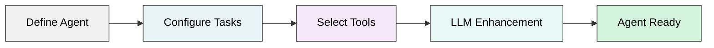

Custom agents execute repeatable tasks on your codebase with precise context and autonomous decision-making. You define the agent's role, goals, and tasks—then the agent handles the rest.

## What Are Custom Agents?

Custom agents are AI-powered assistants that perform specialized tasks using your codebase's knowledge graph. Unlike general-purpose agents, custom agents focus on specific workflows you define.

<CardGroup cols={2}>
  <Card title="Autonomous Execution" icon="robot">
    Execute multi-step tasks autonomously with 60+ specialized tools for code analysis
  </Card>
  <Card title="Semantic Search" icon="magnifying-glass">
    Use semantic search across your knowledge graph with actual code context
  </Card>
  <Card title="Team Collaboration" icon="users">
    Share agents across your team with granular permissions and access control
  </Card>
  <Card title="Knowledge Graph" icon="diagram-project">
    Generate responses based on actual code relationships and dependencies
  </Card>
</CardGroup>

### Common Use Cases

<AccordionGroup>
  <Accordion title="Code Quality & Optimization" icon="gauge-high">
    - Analyze code and suggest optimizations
    - Conduct code reviews with best practices
    - Refactor code for maintainability
    - Identify security vulnerabilities
  </Accordion>
  <Accordion title="Code Generation" icon="code">
    - Generate boilerplate for new features
    - Create unit tests from existing logic
    - Extract documentation from code comments
  </Accordion>
  <Accordion title="Migration & Maintenance" icon="arrows-rotate">
    - Assist with framework migrations
    - Update deprecated patterns
    - Modernize legacy code
  </Accordion>
</AccordionGroup>

## Architecture

<Card>
  Custom agents operate through a three-layer system:

  <Tabs>
    <Tab title="Agent Layer">
      The foundation that defines your agent's identity and purpose.

      **Role** - Professional function (e.g., "Senior Python Developer")

      **Goal** - Primary objective (e.g., "Optimize database queries")

      **Backstory** - Context for credibility and decision-making

      **System Prompt** - High-level instructions and guidelines
    </Tab>

    <Tab title="Task Layer">
      The work your agent performs.

      **Description** - Clear statement of what to accomplish

      **Tools** - Functions the agent can use (1-5 tasks per agent)

      **Expected Output** - Format and structure of results

      **MCP Servers** - Optional external tool integrations
    </Tab>

    <Tab title="Execution Layer">
      How your agent runs tasks.

      **Multi-Agent Mode** - Supervisor delegates to specialists (default)

      **Single-Agent Mode** - Direct execution for simpler tasks

      **Streaming Responses** - Real-time output as agent works
    </Tab>
  </Tabs>
</Card>

## How Custom Agents Work

### Creation Flow



<Steps>
  <Step title="Define Agent Attributes">
    Specify role, goal, and backstory. Write system-level instructions and set execution preferences.
  </Step>

  <Step title="Configure Tasks">
    Describe what each task accomplishes (1-5 per agent). Assign tools from 60+ available options and define expected output format.
  </Step>

  <Step title="AI Enhancement">
    The LLM analyzes your task descriptions, adds step-by-step reasoning prompts, optimizes tool usage patterns, and injects validation strategies.
  </Step>

  <Step title="Execution">
    Agent receives query via conversation API, loads code context from knowledge graph, executes tasks with selected tools, and streams results with citations.
  </Step>
</Steps>

### Auto-Generation

<Info>
  Generate complete agents from natural language prompts—no manual configuration required.
</Info>

```python
POST /api/v1/custom-agents/agents/auto/
{
  "prompt": "Create an agent that reviews Python code for security issues"
}
```

The LLM analyzes your prompt and generates:
- Appropriate role and backstory
- Optimized goal statement
- Complete task breakdown
- Tool recommendations
- System instructions

## Agent Types

<CardGroup cols={3}>
  <Card title="Private" icon="lock">
    **Default**

    Only you can access and execute. Perfect for personal workflows with full control over modifications.
  </Card>

  <Card title="Shared" icon="user-group">
    **Team Collaboration**

    Share with specific team members by email. Collaborators can execute but not modify. Owner retains full control.
  </Card>

  <Card title="Public" icon="globe">
    **Organization-Wide**

    Available to all users in your organization. Discoverable in agent library. Promote reusable workflows.
  </Card>
</CardGroup>

## Multi-Agent Delegation

<Note>
  Complex queries trigger multi-agent mode automatically—no configuration needed.
</Note>

**Supervisor Pattern:**
1. Main agent coordinates overall task
2. Delegates to specialized sub-agents
3. Each specialist handles specific aspects
4. Supervisor synthesizes final answer

**Activation Triggers:**
- Query requires 5+ files
- Task needs cross-system synthesis
- Framework-specific expertise needed

## Permissions & Sharing

<AccordionGroup>
  <Accordion title="Access Control" icon="shield">
    - **Owner**: Full permissions (modify, delete, execute)
    - **Shared Users**: Can execute only
    - **Public Access**: Read-only for non-owners
  </Accordion>

  <Accordion title="Sharing Operations" icon="share-nodes">
    - Share by email address
    - Change visibility level
    - Revoke access anytime
    - View all shared users
  </Accordion>
</AccordionGroup>

## Next Steps

<CardGroup cols={2}>
  <Card title="Create Your First Agent" icon="rocket" href="/custom-agents/configuration">
    Step-by-step guide to building custom agents
  </Card>
  <Card title="Explore Available Tools" icon="wrench" href="/agents/tools-reference">
    60+ tools for code analysis and generation
  </Card>
</CardGroup>
