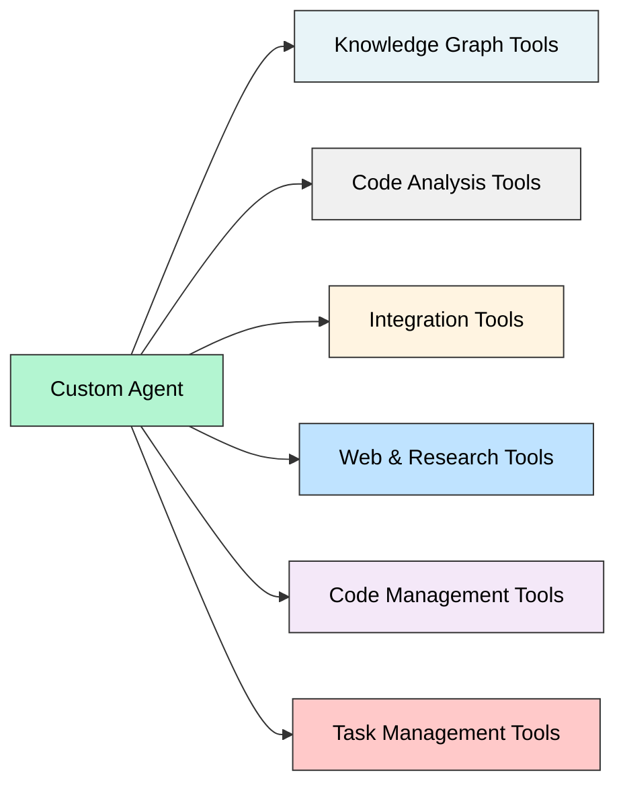

# Available Tools

Custom agents access 60+ specialized tools across six categories: Knowledge Graph, Code Analysis, Integration Tools, Web & Research, Code Management, and Task Management.

## Tool Categories



## Knowledge Graph Tools

Tools for semantic code search and relationship mapping through the knowledge graph.

### ask_knowledge_graph_queries

Executes natural language queries against the knowledge graph to find relevant code.

**Use Case:** When you need to find code based on functionality rather than exact names.

**Parameters:**
```json
{
  "queries": ["What does the UserService do?", "How is authentication implemented?"],
  "project_id": "550e8400-e29b-41d4-a716-446655440000",
  "node_ids": ["123e4567-e89b-12d3-a456-426614174000"]  // optional
}
```

**Returns:** List of matching nodes with code content, file paths, and similarity scores.

---

### get_code_from_probable_node_name

Retrieves code using approximate node names in format `file_path:function_name`.

**Use Case:** When you know the function or class name but not the exact location.

**Parameters:**
```json
{
  "project_id": "550e8400-e29b-41d4-a716-446655440000",
  "probable_node_names": [
    "src/services/auth.ts:validateToken",
    "src/models/User.ts:User"
  ]
}
```

**Returns:** Matching nodes with code, docstrings, and metadata.

---

### get_code_from_node_id

Fetches code snippets for a specific node ID.

**Use Case:** When you have an exact node ID from previous queries.

**Parameters:**
```json
{
  "project_id": "550e8400-e29b-41d4-a716-446655440000",
  "node_id": "123e4567-e89b-12d3-a456-426614174000"
}
```

---

### get_code_from_multiple_node_ids

Retrieves code for multiple node IDs simultaneously.

**Use Case:** Batch retrieval of related code sections.

**Parameters:**
```json
{
  "project_id": "550e8400-e29b-41d4-a716-446655440000",
  "node_ids": ["node_id_1", "node_id_2", "node_id_3"]
}
```

---

### get_nodes_from_tags

Retrieves nodes associated with specific tags in the knowledge graph.

**Use Case:** Finding all functions/classes marked with particular tags (e.g., @deprecated, @public).

**Parameters:**
```json
{
  "project_id": "550e8400-e29b-41d4-a716-446655440000",
  "tags": ["authentication", "deprecated"]
}
```

---

### get_code_graph_from_node_id

Fetches the code graph structure (dependencies, relationships) for a node.

**Best With:** Python, JavaScript, TypeScript files.

**Parameters:**
```json
{
  "node_id": "123e4567-e89b-12d3-a456-426614174000"
}
```

**Returns:** Graph structure showing dependencies, imports, and relationships.

---

### get_node_neighbours_from_node_id

Retrieves all neighboring nodes (dependencies, dependents) for a specific node.

**Use Case:** Understanding what code depends on or uses a particular function/class.

**Parameters:**
```json
{
  "node_id": "123e4567-e89b-12d3-a456-426614174000"
}
```

---

### intelligent_code_graph

Generates intelligent code graph with LLM-based analysis and relationship inference.

**Use Case:** Complex dependency analysis requiring semantic understanding.

**Parameters:**
```json
{
  "project_id": "550e8400-e29b-41d4-a716-446655440000",
  "query": "Map the authentication flow dependencies"
}
```

## Code Analysis Tools

Tools for analyzing file structure, detecting changes, and querying code directly.

### change_detection

Detects changes in the current branch compared to the default branch.

**Use Case:** Reviewing recent modifications, understanding what changed.

**Parameters:**
```json
{
  "project_id": "550e8400-e29b-41d4-a716-446655440000"
}
```

**Returns:** List of modified functions with before/after code.

---

### get_code_file_structure

Retrieves the file and directory structure of the codebase.

**Use Case:** Understanding project organization, finding where files are located.

**Parameters:**
```json
{
  "project_id": "550e8400-e29b-41d4-a716-446655440000",
  "path": "src/"  // optional, defaults to root
}
```

**Returns:** Nested directory structure with files.

---

### fetch_file

Fetches the complete content of a file by path.

**Use Case:** Reading full file contents.

**Parameters:**
```json
{
  "project_id": "550e8400-e29b-41d4-a716-446655440000",
  "file_path": "src/services/auth.ts"
}
```

---

### analyze_code_structure

Performs universal code analysis across multiple languages.

**Use Case:** Extracting functions, classes, imports, and structure from code.

**Parameters:**
```json
{
  "project_id": "550e8400-e29b-41d4-a716-446655440000",
  "file_path": "src/services/auth.ts"
}
```

**Returns:** Parsed structure with functions, classes, imports, and dependencies.

---

### bash_command

Executes bash commands (available when repository manager is enabled).

**Use Case:** Running tests, executing build scripts, checking git status.

<Warning>
Only available when repository manager feature is enabled for the project.
</Warning>

**Parameters:**
```json
{
  "command": "npm test",
  "working_directory": "/path/to/repo"
}
```

## Integration Tools

### Linear

**get_linear_issue**
```json
{
  "issue_id": "PROJECT-123"
}
```
Retrieves Linear issue details including status, assignee, and description.

**update_linear_issue**
```json
{
  "issue_id": "PROJECT-123",
  "status": "In Progress",
  "assignee_id": "user-uuid"
}
```
Updates Linear issue fields.

### Jira

**get_jira_issue**
- Fetches Jira issue by key (e.g., PROJ-123)

**search_jira_issues**
- Searches issues using JQL queries

**create_jira_issue**
- Creates new Jira issues with specified fields

**update_jira_issue**
- Updates existing issue fields

**add_jira_comment**
- Adds comments to issues

**transition_jira_issue**
- Moves issues between workflow states

**get_jira_projects**
- Lists all accessible projects

**get_jira_project_details**
- Retrieves project metadata and configuration

**get_jira_project_users**
- Lists users with access to a project

**link_jira_issues**
- Creates relationships between issues

### Confluence

**get_confluence_spaces**
- Lists all Confluence spaces

**get_confluence_page**
- Retrieves page content by ID

**search_confluence_pages**
- Searches pages using CQL

**get_confluence_space_pages**
- Lists all pages in a space

**create_confluence_page**
- Creates new pages with content

**update_confluence_page**
- Updates existing page content

**add_confluence_comment**
- Adds comments to pages

## Web & Research Tools

### webpage_extractor

Extracts content from web pages for research and documentation.

**Use Case:** Fetching external documentation, API references, or research materials.

**Parameters:**
```json
{
  "url": "https://example.com/docs/api"
}
```

**Returns:** Extracted text content from the webpage.

---

### web_search_tool

Performs web searches to find documentation and solutions.

**Use Case:** Looking up framework documentation, error messages, or best practices.

**Parameters:**
```json
{
  "query": "Next.js server-side authentication best practices"
}
```

**Returns:** Search results with URLs and summaries.

## Code Provider Tools

Tools for interacting with GitHub, GitLab, and other code providers.

### code_provider_tool / github_tool

Fetches repository information and metadata.

**Parameters:**
```json
{
  "project_id": "550e8400-e29b-41d4-a716-446655440000",
  "action": "get_repository_info"
}
```

---

### code_provider_create_branch / github_create_branch

Creates a new branch in the repository.

**Parameters:**
```json
{
  "project_id": "550e8400-e29b-41d4-a716-446655440000",
  "branch_name": "feature/new-feature",
  "base_branch": "main"
}
```

---

### code_provider_create_pr / github_create_pull_request

Creates a pull request.

**Parameters:**
```json
{
  "project_id": "550e8400-e29b-41d4-a716-446655440000",
  "title": "Add authentication feature",
  "body": "Implements user authentication...",
  "head_branch": "feature/auth",
  "base_branch": "main"
}
```

---

### code_provider_add_pr_comments / github_add_pr_comments

Adds comments to pull requests.

**Parameters:**
```json
{
  "project_id": "550e8400-e29b-41d4-a716-446655440000",
  "pr_number": 42,
  "comment": "LGTM! Great work on the authentication implementation."
}
```

---

### code_provider_update_file / github_update_branch

Updates file content in a repository branch.

**Parameters:**
```json
{
  "project_id": "550e8400-e29b-41d4-a716-446655440000",
  "branch_name": "feature/auth",
  "file_path": "src/auth.ts",
  "content": "export function authenticate() { ... }",
  "commit_message": "Update authentication logic"
}
```

## Code Management Tools

18 tools for managing code changes in agent memory (reduces token usage).

### File Operations

**add_file_to_changes**
- Track new files you're creating

**update_file_in_changes**
- Replace entire file content

**delete_file_in_changes**
- Mark file for deletion

---

### Targeted Editing

**update_file_lines**
- Modify specific line ranges

**replace_in_file**
- Find and replace text patterns

**insert_lines**
- Insert new lines at specific positions

**delete_lines**
- Remove specific line ranges

---

### Querying Changes

**get_file_from_changes**
- Retrieve current state of a file

**list_files_in_changes**
- List all tracked files

**search_content_in_changes**
- Search across all changed files

**get_file_diff**
- See diff against repository version

---

### Management & Export

**clear_file_from_changes**
- Discard changes for specific file

**clear_all_changes**
- Discard all tracked changes

**get_changes_summary**
- Overview of all changes

**export_changes**
- Export in JSON or diff format

**get_session_metadata**
- Complete session state information

---

### Display Tools

**show_updated_file**
- Stream complete file content to user

**show_diff**
- Show git-style diff to user

## Task Management Tools

6 tools for tracking multi-step operations and agent state.

### create_todo

Creates a new todo item for task tracking.

**Parameters:**
```json
{
  "title": "Implement user authentication",
  "description": "Add JWT-based authentication to API",
  "priority": "high",
  "assigned_agent": "security_agent",
  "dependencies": []
}
```

---

### update_todo_status

Updates todo item status.

**Statuses:** `pending`, `in_progress`, `completed`, `cancelled`, `blocked`

**Parameters:**
```json
{
  "todo_id": "todo_uuid",
  "status": "in_progress"
}
```

---

### add_todo_note

Adds progress notes to a todo.

**Parameters:**
```json
{
  "todo_id": "todo_uuid",
  "note": "Completed JWT token generation, working on refresh logic"
}
```

---

### get_todo

Retrieves detailed information about a specific todo.

---

### list_todos

Lists all todos, optionally filtered by status.

**Parameters:**
```json
{
  "status": "in_progress"  // optional
}
```

---

### get_todo_summary

Gets overview of all todos and their statuses.

## Requirement Verification Tools

3 tools for tracking complex task requirements.

### add_requirements

Documents all output requirements at task start.

**Use Case:** Complex tasks with multiple deliverables.

**Parameters:**
```json
{
  "requirements": "- Function handles null inputs\n- Returns proper error codes\n- Includes unit tests"
}
```

---

### get_requirements

Reads current requirements document.

<Tip>
Use this before finalizing responses to ensure all requirements are met.
</Tip>

---

### delete_requirements

Clears the requirements document.

## Tool Selection Guide

### By Use Case

| Task | Recommended Tools |
|------|------------------|
| Finding code by functionality | `ask_knowledge_graph_queries` |
| Finding code by name | `get_code_from_probable_node_name` |
| Understanding dependencies | `get_code_graph_from_node_id`, `get_node_neighbours_from_node_id` |
| Reviewing recent changes | `change_detection` |
| Exploring file structure | `get_code_file_structure` |
| Making code changes | Code Management tools (`add_file_to_changes`, `update_file_lines`, etc.) |
| Tracking progress | Task Management tools (`create_todo`, `update_todo_status`, etc.) |
| External integrations | Jira, Linear, Confluence tools |
| Research & documentation | `web_search_tool`, `webpage_extractor` |

### By Agent Type

**QnA / Research Agents:**
- Knowledge Graph tools
- Code Analysis tools
- Web & Research tools

**Code Generation Agents:**
- Knowledge Graph tools
- Code Management tools
- Code Provider tools
- Requirement Verification tools

**Debugging Agents:**
- Knowledge Graph tools
- Code Analysis tools
- `change_detection`
- Task Management tools

**Integration Agents:**
- Jira, Linear, Confluence tools
- Code Provider tools
- Task Management tools

## Best Practices

**Combine Tools for Better Results:**
```python
# Example: Find and analyze authentication code
1. ask_knowledge_graph_queries(["How is authentication implemented?"])
2. get_code_from_node_id(node_id_from_step_1)
3. get_node_neighbours_from_node_id(node_id) # See dependencies
```

**Use Appropriate Granularity:**
- Single node: `get_code_from_node_id`
- Multiple related nodes: `get_code_from_multiple_node_ids`
- Fuzzy search: `get_code_from_probable_node_name`
- Semantic search: `ask_knowledge_graph_queries`

**Reduce Token Usage:**
- Use Code Management tools to track changes in memory
- Avoid including full file contents in responses
- Use `show_updated_file` to display files to users directly

**Track Complex Work:**
- Create todos at task start
- Update status as you progress
- Add notes for important findings
- Document requirements upfront

## Integration with Agents

Tools are specified in the `tasks` array of your agent definition:

```python
{
  "tasks": [
    {
      "description": "Find and analyze authentication code",
      "tools": [
        "ask_knowledge_graph_queries",
        "get_code_from_node_id",
        "get_node_neighbours_from_node_id"
      ],
      "expected_output": {
        "format": "markdown",
        "sections": ["authentication_flow", "security_analysis"]
      }
    }
  ]
}
```

<Warning>
**Tool Validation:**
- Tool IDs are validated when creating agents
- Invalid tool IDs result in 400 error
- Check this page for current tool IDs
- Tool availability may depend on project configuration
</Warning>

## Next Steps

<CardGroup cols={2}>
  <Card title="Create Custom Agent" icon="rocket" href="/custom-agents/configuration">
    Use these tools in your agent configuration
  </Card>
  <Card title="API Reference" icon="code" href="/api-reference/agents">
    Complete API documentation
  </Card>
</CardGroup>
