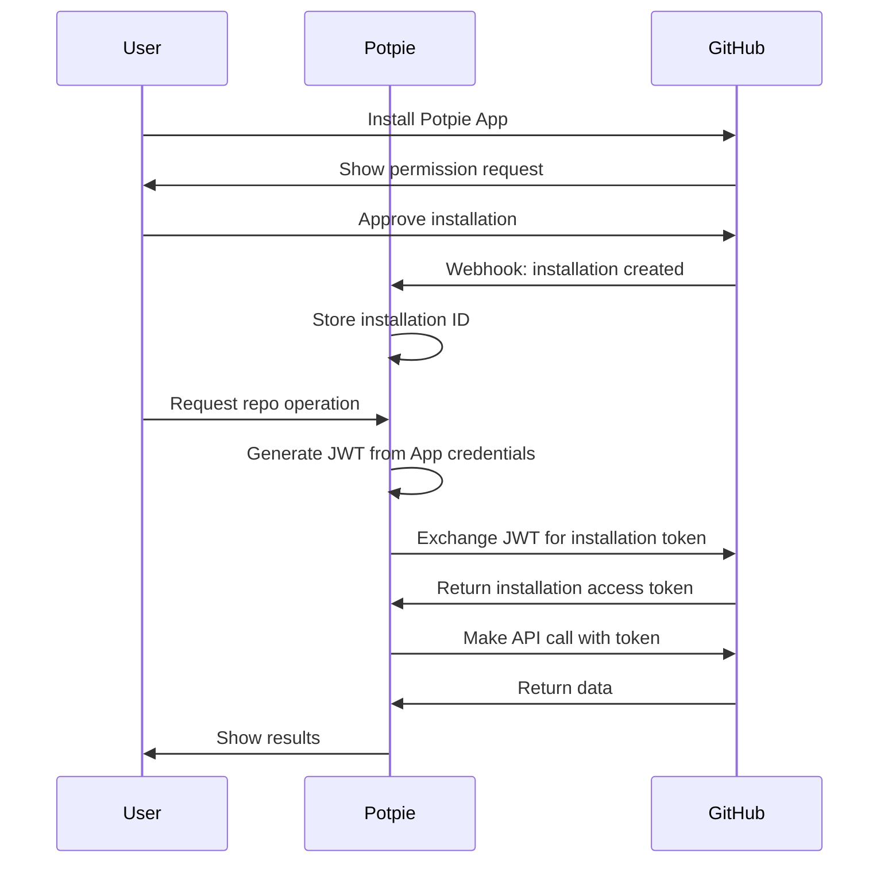

## Overview

The GitHub integration enables Potpie agents to interact with your GitHub repositories through a GitHub App installation, providing secure access to code, pull requests, branches, and issues.

<CardGroup cols={2}>
  <Card title="GitHub App" icon="github">
    Secure app-based authentication with fine-grained permissions
  </Card>
  <Card title="Code Operations" icon="code">
    Read files, create branches, update code, and manage PRs
  </Card>
  <Card title="PR Management" icon="code-pull-request">
    Create, review, and comment on pull requests
  </Card>
  <Card title="Issue Tracking" icon="circle-dot">
    Fetch and analyze GitHub issues and discussions
  </Card>
</CardGroup>

---

## Quick Start

### Prerequisites

- GitHub account with repository access
- Repository admin permissions (for app installation)
- Potpie account

### Setup Steps

<Steps>
  <Step title="Install Potpie GitHub App">
    Go to [Potpie GitHub App](https://github.com/apps/potpie-ai)

    Click "Install" and select repositories:
    - All repositories, or
    - Select specific repositories
  </Step>

  <Step title="Configure Backend">
    Add GitHub App credentials to your environment:

    ```bash
    GITHUB_APP_ID=your_app_id
    GITHUB_PRIVATE_KEY_PATH=/path/to/private-key.pem
    GITHUB_PAT=fallback_personal_access_token
    ```
  </Step>

  <Step title="Verify Installation">
    In Potpie, parse a repository:
    1. Go to New Chat
    2. Select repository dropdown
    3. Your GitHub repos should appear
  </Step>

  <Step title="Start Using">
    Ask agents to interact with GitHub:

    *"Show me the latest PR for repo owner/repo"*

    *"Create a branch called feature/new-auth"*

    *"Read the contents of src/auth.js"*
  </Step>
</Steps>

---

## GitHub App Setup

### Installation Process

1. **Navigate to App Installation**
   - Go to https://github.com/apps/potpie-ai
   - Or in repository: Settings → GitHub Apps

2. **Grant Permissions**
   The Potpie GitHub App requests:
   - **Read**: Repository contents, pull requests, issues
   - **Write**: Pull requests, branches, commit status
   - **Admin**: Webhooks (optional)

3. **Select Repositories**
   ```
   ○ All repositories
   ● Only select repositories
     ☑ my-project
     ☑ backend-api
     ☐ private-repo
   ```

4. **Installation ID**
   After installation, GitHub provides an installation ID.
   Potpie uses this to authenticate API calls.

### Authentication Flow



### Key Concepts

**GitHub App vs OAuth App**:
- **GitHub App**: Installation-based, fine-grained permissions, app-level auth
- **OAuth App**: User-based, broader permissions, user-level auth
- **Potpie uses**: GitHub App for better security and control

**Installation Token**:
- Short-lived (1 hour)
- Generated from JWT signed with private key
- Scoped to installed repositories only

**JWT Creation**:
```python
import jwt
import time

payload = {
    'iat': int(time.time()),
    'exp': int(time.time()) + 600,  # 10 minutes
    'iss': GITHUB_APP_ID
}

jwt_token = jwt.encode(payload, private_key, algorithm='RS256')
```

---

## Available Tools

### 1. GitHub Tool

Fetch GitHub issues and pull requests with full details.

**Tool**: `github_tool`

**Usage**:
```
"Show me issue #123 from owner/repo"
"Get PR #456 with diff from owner/repo"
"What's in pull request #789 for owner/repo?"
```

**Features**:
- Issue details (title, body, comments, labels)
- PR information (title, description, status)
- PR diffs (file changes, additions, deletions)
- Metadata (author, created/updated dates, assignees)

### 2. Code Provider Tool

Read file contents from repositories.

**Tool**: `code_provider_tool`

**Usage**:
```
"Read src/index.js from owner/repo"
"Show me the contents of package.json"
"Get README.md file"
```

**Features**:
- Fetch file contents
- Support for all file types
- Directory listing
- Branch specification

### 3. Create Branch

Create new branches from existing branches or commits.

**Tool**: `code_provider_create_branch`

**Usage**:
```
"Create a branch called feature/oauth from main"
"Make a new branch hotfix/auth-bug from develop"
```

**Parameters**:
- Branch name
- Base branch/commit SHA
- Repository

### 4. Update File

Modify file contents and commit changes.

**Tool**: `code_provider_update_file`

**Usage**:
```
"Update src/config.js to add new API endpoint"
"Change line 45 in auth.py to fix the bug"
```

**Features**:
- Single file updates
- Automatic commit creation
- Commit message generation
- Branch targeting

### 5. Create Pull Request

Create PRs with title, description, and reviewers.

**Tool**: `code_provider_create_pr`

**Usage**:
```
"Create a PR from feature/oauth to main"
"Open pull request for branch feature/new-auth"
```

**Parameters**:
- Source branch (head)
- Target branch (base)
- Title
- Description
- Reviewers (optional)
- Assignees (optional)

### 6. Add PR Comment

Add comments to pull requests or specific lines.

**Tool**: `code_provider_add_pr_comment`

**Usage**:
```
"Add comment to PR #123: 'Looks good!'"
"Comment on line 45 of src/auth.js in PR #456"
```

**Features**:
- General PR comments
- Line-specific comments
- Review comments
- Reply to existing comments

---

## Usage Examples

### Example 1: Analyze Pull Request

**User Query**:
```
"Analyze PR #142 in potpie-ai/potpie and suggest improvements"
```

**Agent Response**:
```markdown
## Pull Request #142 Analysis

**Title**: Add OAuth authentication flow

**Status**: Open
**Author**: @john-dev
**Created**: 2 days ago
**Changed Files**: 5 files (+243, -67)

### Files Changed:
1. `src/auth/oauth.py` (+156, -12)
2. `src/config.py` (+23, -8)
3. `tests/test_oauth.py` (+52, -0)
4. `README.md` (+10, -5)
5. `requirements.txt` (+2, -42)

### Code Review:

✅ **Strengths**:
- Comprehensive test coverage
- Clean implementation
- Good error handling

⚠️ **Suggestions**:
1. **Line 45, oauth.py**: Consider adding rate limiting
2. **Line 89, oauth.py**: Token refresh logic could use exponential backoff
3. **Config**: Missing environment variable documentation

### Recommended Changes:
```python
# In oauth.py, line 45
+from ratelimit import limits
+
+@limits(calls=10, period=60)
 def exchange_code_for_token(code):
     # ...
```

**Verdict**: Approve with minor changes
```

### Example 2: Create Feature Branch and PR

**User Query**:
```
"Create a new branch called feature/rate-limiting, update src/api.py to add rate limiting, and create a PR"
```

**Agent Actions**:
1. Creates branch `feature/rate-limiting` from `main`
2. Updates `src/api.py` with rate limiting code
3. Commits changes
4. Creates pull request

**Agent Response**:
```markdown
✅ Created branch: feature/rate-limiting

✅ Updated src/api.py:
- Added rate limiting middleware
- Configured limits: 100 req/min
- Added Redis for rate limit storage

✅ Committed changes:
Commit: abc123def
Message: "Add rate limiting middleware"

✅ Created Pull Request #143:
**Title**: Add rate limiting to API endpoints
**URL**: https://github.com/potpie-ai/potpie/pull/143
**Status**: Open

**Description**:
Implements rate limiting using Flask-Limiter:
- 100 requests per minute per IP
- Redis backend for distributed limiting
- Graceful degradation if Redis unavailable

Ready for review!
```

### Example 3: Review and Comment on PR

**User Query**:
```
"Review PR #144 and add comments on any security issues"
```

**Agent Response**:
```markdown
## Security Review: PR #144

**Title**: User authentication endpoint

### 🔒 Security Issues Found:

**1. SQL Injection Risk (HIGH)**
📍 File: `src/db/users.py`, Line 23
```python
# Current (VULNERABLE):
query = f"SELECT * FROM users WHERE email = '{email}'"

# Suggested fix:
query = "SELECT * FROM users WHERE email = %s"
cursor.execute(query, (email,))
```
💬 Added comment to PR

**2. Password Storage (HIGH)**
📍 File: `src/auth/password.py`, Line 45
```python
# Current (WEAK):
hashed = hashlib.md5(password.encode()).hexdigest()

# Suggested fix:
from bcrypt import hashpw, gensalt
hashed = hashpw(password.encode(), gensalt(12))
```
💬 Added comment to PR

**3. Missing Rate Limiting (MEDIUM)**
📍 File: `src/routes/auth.py`, Line 12
No rate limiting on login endpoint - susceptible to brute force

💬 Added comment to PR

### ✅ Request Changes
PR needs security fixes before merging.
```

---

## API Integration Details

### GitHub App Authentication

**JWT Generation**:
```python
# 1. Create JWT
jwt_token = create_jwt(
    app_id=GITHUB_APP_ID,
    private_key=PRIVATE_KEY
)

# 2. Get installation token
response = requests.post(
    f"https://api.github.com/app/installations/{installation_id}/access_tokens",
    headers={"Authorization": f"Bearer {jwt_token}"}
)

installation_token = response.json()["token"]
```

**API Calls**:
```python
# Use installation token for API calls
headers = {
    "Authorization": f"Bearer {installation_token}",
    "Accept": "application/vnd.github.v3+json"
}

response = requests.get(
    "https://api.github.com/repos/owner/repo/pulls/123",
    headers=headers
)
```

### Rate Limits

**GitHub API Rate Limits**:
- **REST API**: 5,000 requests/hour (per installation)
- **GraphQL API**: 5,000 points/hour
- **Search API**: 30 requests/minute

**Potpie Handling**:
- Automatic retry with exponential backoff
- Rate limit monitoring
- Request queuing when approaching limits
- Fallback to PAT if app token unavailable

---

## Troubleshooting

### Issue: "Repository not accessible"

**Cause**: GitHub App not installed on repository

**Solution**:
1. Go to https://github.com/apps/potpie-ai
2. Click "Configure"
3. Add the repository to the installation
4. Refresh Potpie

### Issue: "Invalid private key"

**Cause**: Wrong private key or incorrect format

**Solution**:
1. Download private key from GitHub App settings
2. Save as `.pem` file
3. Update `GITHUB_PRIVATE_KEY_PATH` environment variable
4. Ensure file has correct permissions (600)

### Issue: "Installation not found"

**Cause**: Installation ID not available for repository

**Solution**:
1. Verify app is installed: Settings → Integrations → GitHub Apps
2. Reinstall if necessary
3. Check installation webhook was received
4. Contact support if issue persists

### Issue: "Rate limit exceeded"

**Cause**: Too many API requests

**Solution**:
- Wait for rate limit reset (shown in error)
- Use GraphQL API for batch queries
- Implement caching for frequent queries
- Consider upgrading GitHub plan

---

## Best Practices

<AccordionGroup>
  <Accordion title="Security" icon="shield-halved">
    - Store private key securely (not in repo)
    - Use environment variables for credentials
    - Rotate GitHub App credentials periodically
    - Review app permissions regularly
    - Monitor installation access logs
  </Accordion>

  <Accordion title="Performance" icon="gauge-high">
    - Cache file contents when possible
    - Use GraphQL for multiple resource queries
    - Batch operations when available
    - Monitor rate limit usage
    - Implement exponential backoff
  </Accordion>

  <Accordion title="Workflow" icon="diagram-project">
    - Use descriptive branch names
    - Write clear commit messages
    - Include context in PR descriptions
    - Request reviews from relevant team members
    - Link PRs to issues
  </Accordion>
</AccordionGroup>

---

## Support & Resources

<CardGroup cols={2}>
  <Card title="GitHub Apps Docs" icon="book" href="https://docs.github.com/en/developers/apps">
    Official GitHub Apps documentation
  </Card>
  <Card title="REST API Reference" icon="code" href="https://docs.github.com/en/rest">
    GitHub REST API documentation
  </Card>
  <Card title="Install App" icon="download" href="https://github.com/apps/potpie-ai">
    Install Potpie GitHub App
  </Card>
  <Card title="Support" icon="life-ring" href="mailto:hi@potpie.ai">
    Contact Potpie support
  </Card>
</CardGroup>

---

## What's Next?

<CardGroup cols={2}>
  <Card title="Linear Integration" icon="link" href="/extensions/linear">
    Link GitHub PRs to Linear issues
  </Card>
  <Card title="Jira Integration" icon="puzzle-piece" href="/extensions/jira">
    Connect GitHub with Jira workflow
  </Card>
  <Card title="Code Agent" icon="robot" href="/agents/code-changes-agent">
    Use AI to generate code changes
  </Card>
  <Card title="Custom Agents" icon="screwdriver-wrench" href="/custom-agents/introduction">
    Build agents with GitHub tools
  </Card>
</CardGroup>
