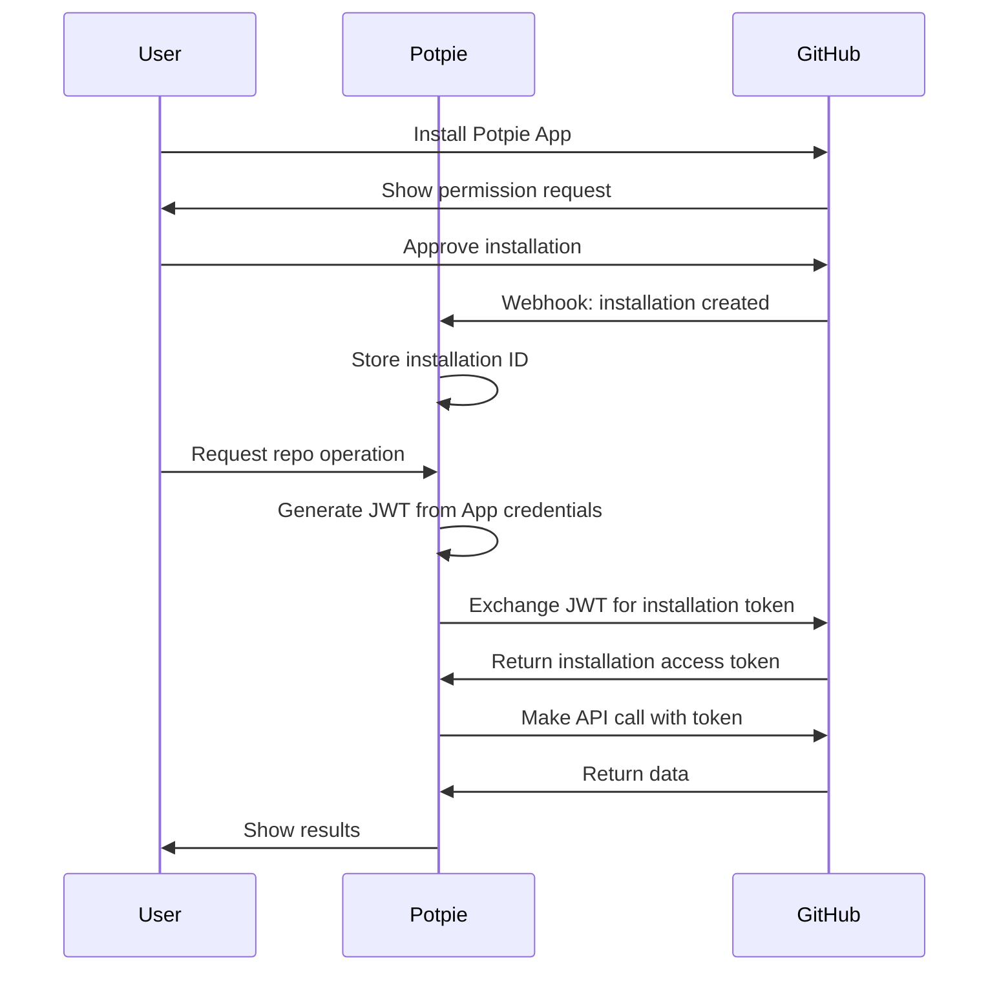

## Overview

The **GitHub integration** enables Potpie agents to interact with GitHub repositories through a **GitHub App** installation. The app provides secure, fine-grained access to code, pull requests, branches, and issues.

<CardGroup cols={2}>
  <Card title="GitHub App" icon="github">
    Secure app-based authentication with fine-grained permissions
  </Card>
  <Card title="Code Operations" icon="code">
    Read files, create branches, update code, and manage PRs
  </Card>
  <Card title="PR Management" icon="code-pull-request">
    Create, review, and comment on pull requests
  </Card>
  <Card title="Issue Tracking" icon="circle-dot">
    Fetch and analyze GitHub issues and discussions
  </Card>
</CardGroup>

---

## Quick Start

### Prerequisites

- GitHub account with repository access
- Repository admin permissions (for app installation)
- Potpie account

### Setup Steps

<Steps>
  <Step title="Install Potpie GitHub App">
    Open [Potpie GitHub App](https://github.com/apps/potpie-ai) and click **Install**. Select repositories:
    - All repositories, or
    - Specific repositories only
  </Step>

  <Step title="Configure Backend">
    Add **GitHub App** credentials to the environment:

    ```bash
    GITHUB_APP_ID=your_app_id
    GITHUB_PRIVATE_KEY_PATH=/path/to/private-key.pem
    GITHUB_PAT=fallback_personal_access_token
    ```
  </Step>

  <Step title="Verify Installation">
    Parse a repository in Potpie to verify the connection:
    1. Go to New Chat
    2. Select the repository dropdown
    3. GitHub repos appear in the list
  </Step>

  <Step title="Start Using">
    Ask agents to interact with GitHub:

    *"Show me the latest PR for repo owner/repo"*

    *"Create a branch called feature/new-auth"*

    *"Read the contents of src/auth.js"*
  </Step>
</Steps>

---

## GitHub App Setup

### Installation Process

1. **Navigate to App Installation**
   - Go to https://github.com/apps/potpie-ai
   - Or in repository: Settings → GitHub Apps

2. **Grant Permissions**
   The Potpie GitHub App requests:
   - **Read**: Repository contents, pull requests, issues
   - **Write**: Pull requests, branches, commit status
   - **Admin**: Webhooks (optional)

3. **Select Repositories**
   ```
   ○ All repositories
   ● Only select repositories
     ☑ my-project
     ☑ backend-api
     ☐ private-repo
   ```

4. **Installation ID**
   After installation, GitHub provides an **installation ID**. Potpie uses this to authenticate API calls.

### Authentication Flow



### Key Concepts

**GitHub App vs OAuth App:**
- **GitHub App**: Installation-based, fine-grained permissions, app-level auth
- **OAuth App**: User-based, broader permissions, user-level auth

**Installation Token:**
- Short-lived (1 hour)
- Generated from a **JWT** signed with the private key
- Scoped to installed repositories only

**JWT Creation:**
```python
import jwt
import time

payload = {
    'iat': int(time.time()),
    'exp': int(time.time()) + 600,  # 10 minutes
    'iss': GITHUB_APP_ID
}

jwt_token = jwt.encode(payload, private_key, algorithm='RS256')
```

---

## Available Tools

### 1. GitHub Tool

Fetch GitHub issues and pull requests with full details.

**Tool:** `github_tool`

**Usage:**
```
"Show me issue #123 from owner/repo"
"Get PR #456 with diff from owner/repo"
"What's in pull request #789 for owner/repo?"
```

### 2. Code Provider Tool

Read file contents from repositories.

**Tool:** `code_provider_tool`

**Usage:**
```
"Read src/index.js from owner/repo"
"Show me the contents of package.json"
"Get README.md file"
```

### 3. Create Branch

Create new branches from existing branches or commits.

**Tool:** `code_provider_create_branch`

**Usage:**
```
"Create a branch called feature/oauth from main"
"Make a new branch hotfix/auth-bug from develop"
```

### 4. Update File

Modify file contents and commit changes.

**Tool:** `code_provider_update_file`

**Usage:**
```
"Update src/config.js to add new API endpoint"
"Change line 45 in auth.py to fix the bug"
```

### 5. Create Pull Request

Create PRs with title, description, and reviewers.

**Tool:** `code_provider_create_pr`

**Usage:**
```
"Create a PR from feature/oauth to main"
"Open pull request for branch feature/new-auth"
```

### 6. Add PR Comment

Add comments to pull requests or specific lines.

**Tool:** `code_provider_add_pr_comment`

**Usage:**
```
"Add comment to PR #123: 'Looks good!'"
"Comment on line 45 of src/auth.js in PR #456"
```

---

## API Integration Details

### GitHub App Authentication

**JWT Generation:**
```python
# 1. Create JWT
jwt_token = create_jwt(
    app_id=GITHUB_APP_ID,
    private_key=PRIVATE_KEY
)

# 2. Get installation token
response = requests.post(
    f"https://api.github.com/app/installations/{installation_id}/access_tokens",
    headers={"Authorization": f"Bearer {jwt_token}"}
)

installation_token = response.json()["token"]
```

**API Calls:**
```python
# Use installation token for API calls
headers = {
    "Authorization": f"Bearer {installation_token}",
    "Accept": "application/vnd.github.v3+json"
}

response = requests.get(
    "https://api.github.com/repos/owner/repo/pulls/123",
    headers=headers
)
```

---

## Next Steps

<CardGroup cols={2}>
  <Card title="Linear Integration" icon="link" href="/extensions/linear">
    Link GitHub PRs to Linear issues
  </Card>
  <Card title="Jira Integration" icon="puzzle-piece" href="/extensions/jira">
    Connect GitHub with Jira workflow
  </Card>
  <Card title="Build a Feature" icon="robot" href="/build-flow/build-a-feature">
    Use AI to generate code changes
  </Card>
  <Card title="Custom Agents" icon="screwdriver-wrench" href="/custom-agents/introduction">
    Build agents with GitHub tools
  </Card>
</CardGroup>
