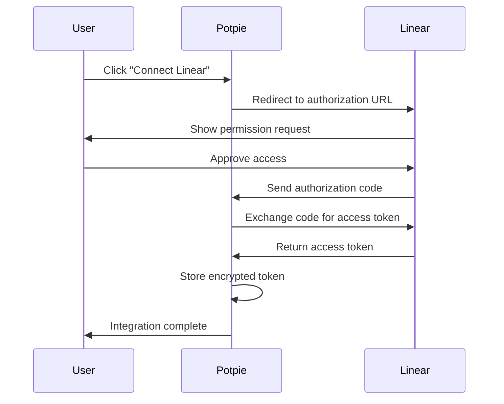

## Overview

The **Linear integration** enables Potpie agents to fetch issue details, update issue status, and manage project workflows directly within the development environment.


## Quick Start

### Prerequisites

- Active Linear workspace
- Linear OAuth application credentials

### Setup Steps

<Steps>
  <Step title="Create Linear OAuth App">
    Go to <a href="https://linear.app/settings/api" className="mode-link">Linear Settings → API → OAuth Applications</a>

    Create a new OAuth application with:
    - **Name**: Potpie Integration
    - **Redirect URL**: `https://app.potpie.ai/integrations/linear/callback`
    - **Scopes**: `read` (minimum required)
  </Step>

  <Step title="Connect the Workspace">
    In the Potpie dashboard:
    1. Navigate to Settings → Integrations
    2. Click **Connect** on Linear
    3. Authorize Potpie to access the Linear workspace
    4. Name the integration instance
  </Step>

  <Step title="Start Using">
    Ask agents to interact with Linear:

    *"Get details for Linear issue ABC-123"*

    *"Update Linear issue ABC-456 status to In Progress"*
  </Step>
</Steps>

---

## Available Tools

The Linear integration provides 2 tools. See <a href="/agents/tools-reference#linear-tools" className="mode-link">Linear Tools</a> in the Tools Reference for full documentation.

| Tool | Description |
|------|-------------|
| `get_linear_issue` | Fetch issue details |
| `update_linear_issue` | Update issue fields |

---

## Self-Hosted Setup

### Backend Configuration

Add Linear OAuth credentials to the environment:

```bash
LINEAR_CLIENT_ID=your_linear_client_id
LINEAR_CLIENT_SECRET=your_linear_client_secret
```

### OAuth App Setup

1. **Access Linear Settings**
   - Go to the Linear workspace
   - Navigate to Settings → API
   - Click **OAuth Applications**

2. **Create New Application**
   ```
   Application Name: Potpie AI Integration
   Description: AI-powered codebase assistant
   Redirect URI: https://{your-deployment-hostname}/api/v1/integrations/linear/callback
   Scopes: read (required for fetching issues)
   ```

   <Note>
     The redirect URI is dynamically constructed from the deployment hostname. Replace `{your-deployment-hostname}` with the actual hostname of your Potpie deployment.
   </Note>

3. **Save Credentials**
   - Copy the **Client ID**
   - Copy the **Client Secret**
   - Store both securely in environment variables

### Authorization Flow



### Scopes

| Scope | Access Level | Required |
|-------|-------------|----------|
| `read` | Read issues, teams, projects | ✅ Yes |

### API Integration Details

**Authentication Type:** OAuth 2.0
**Authorization URL:** `https://linear.app/oauth/authorize`
**Token URL:** `https://api.linear.app/oauth/token`

**Token Storage:**
- Encrypts access tokens at rest
- Stores tokens in the Potpie database

**GraphQL Endpoint:** `https://api.linear.app/graphql`
**Method:** POST
**Content-Type:** `application/json`

**Authentication Header:**
```
Authorization: Bearer YOUR_ACCESS_TOKEN
```

**Request Format:**
```json
{
  "query": "query GetIssue($id: String!) { issue(id: $id) { id title status } }",
  "variables": {
    "id": "issue-uuid"
  }
}
```

For Potpie API endpoints that manage the Linear integration lifecycle, see the <a href="/api-reference/introduction" className="mode-link">API Reference</a>.
