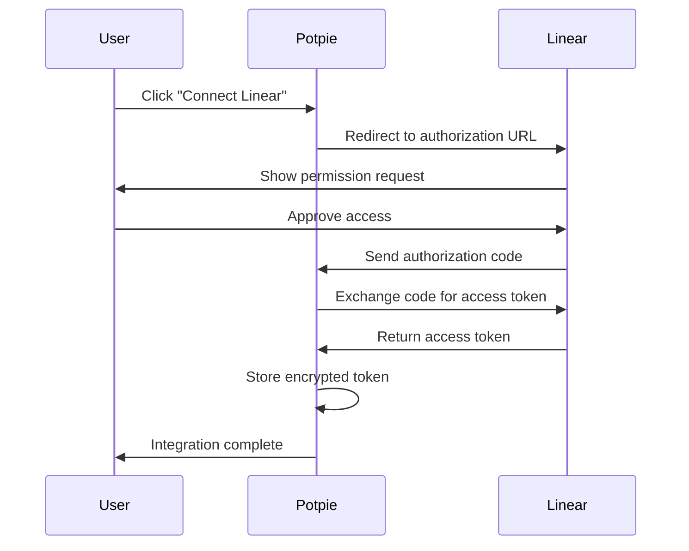

## Overview

The Linear integration enables Potpie agents to interact with your Linear workspace, allowing you to fetch issue details, update issue status, and manage your project workflow without leaving your development environment.

<CardGroup cols={2}>
  <Card title="Quick Access" icon="bolt">
    Get and update Linear issues directly through AI agents
  </Card>
  <Card title="GraphQL API" icon="diagram-project">
    Powered by Linear's GraphQL API for efficient data fetching
  </Card>
  <Card title="OAuth 2.0" icon="shield-check">
    Secure authentication with Linear OAuth 2.0
  </Card>
  <Card title="Automatic Sync" icon="arrows-rotate">
    Real-time access to your Linear workspace data
  </Card>
</CardGroup>

---

## Quick Start

### Prerequisites

- Active Linear workspace
- Linear OAuth application credentials
- Potpie account with API access

### Setup Steps

<Steps>
  <Step title="Create Linear OAuth App">
    Go to [Linear Settings → API → OAuth Applications](https://linear.app/settings/api)

    Create a new OAuth application with:
    - **Name**: Potpie Integration
    - **Redirect URL**: `https://app.potpie.ai/integrations/linear/callback`
    - **Scopes**: `read` (minimum required)
  </Step>

  <Step title="Configure Environment Variables">
    Add your Linear OAuth credentials to your environment:

    ```bash
    LINEAR_CLIENT_ID=your_linear_client_id
    LINEAR_CLIENT_SECRET=your_linear_client_secret
    ```
  </Step>

  <Step title="Connect Your Workspace">
    In Potpie dashboard:
    1. Navigate to Settings → Integrations
    2. Click "Connect" on Linear
    3. Authorize Potpie to access your Linear workspace
    4. Name your integration instance
  </Step>

  <Step title="Start Using">
    Ask agents to interact with Linear:

    *"Get details for Linear issue ABC-123"*

    *"Update Linear issue ABC-456 status to In Progress"*
  </Step>
</Steps>

---

## OAuth Setup Guide

### Creating a Linear OAuth Application

1. **Access Linear Settings**
   - Go to your Linear workspace
   - Navigate to Settings → API
   - Click on "OAuth Applications"

2. **Create New Application**
   ```
   Application Name: Potpie AI Integration
   Description: AI-powered codebase assistant
   Redirect URI: https://app.potpie.ai/integrations/linear/callback
   Scopes: read (required for fetching issues)
   ```

3. **Save Credentials**
   - Copy the **Client ID**
   - Copy the **Client Secret**
   - Store securely in your environment variables

### Authorization Flow



### Scopes Explained

| Scope | Access Level | Required |
|-------|-------------|----------|
| `read` | Read issues, teams, projects | ✅ Yes |
| `write` | Create and update issues | Optional |
| `admin` | Full workspace access | Not recommended |

<Note>
  Start with `read` scope only. Additional scopes can be added later if needed.
</Note>

---

## Available Tools

### 1. Get Linear Issue

Fetch detailed information about a Linear issue.

**Tool Name**: `get_linear_issue`

**Usage**:
```
"Get Linear issue ABC-123"
"Show me details for issue ABC-456"
"What's the status of Linear issue XYZ-789?"
```

**Returns**:
- Issue ID and key
- Title and description
- Status and state
- Assignee information
- Team and project
- Priority level
- Issue URL
- Created/updated timestamps

**GraphQL Query**:
```graphql
query GetIssue($id: String!) {
  issue(id: $id) {
    id
    title
    description
    state {
      id
      name
    }
    assignee {
      id
      name
    }
    team {
      id
      name
    }
    priority
    url
    createdAt
    updatedAt
  }
}
```

### 2. Update Linear Issue

Update properties of a Linear issue.

**Tool Name**: `update_linear_issue`

**Usage**:
```
"Update Linear issue ABC-123 status to In Progress"
"Change priority of issue ABC-456 to high"
"Assign Linear issue XYZ-789 to john@company.com"
```

**Updatable Fields**:
- Title
- Description
- Status/State
- Priority
- Assignee
- Team
- Labels

**GraphQL Mutation**:
```graphql
mutation UpdateIssue($id: String!, $input: IssueUpdateInput!) {
  issueUpdate(id: $id, input: $input) {
    success
    issue {
      id
      title
      state {
        name
      }
    }
  }
}
```

---

## Usage Examples

### Example 1: Fetch Issue Details

**User Query**:
```
"What's the status of Linear issue ENG-245?"
```

**Agent Response**:
```markdown
## Linear Issue ENG-245

**Title**: Implement OAuth authentication flow

**Status**: In Progress

**Assignee**: Sarah Chen

**Priority**: High (Priority 1)

**Description**:
Need to implement OAuth 2.0 authentication flow for the Linear integration.
This includes:
- Authorization URL generation
- Token exchange
- Token refresh logic

**Team**: Engineering

**Created**: 2024-02-10
**Updated**: 2024-02-17

**URL**: https://linear.app/yourcompany/issue/ENG-245
```

### Example 2: Update Issue Status

**User Query**:
```
"Move Linear issue ENG-245 to code review"
```

**Agent Action**:
1. Fetches current issue state
2. Identifies "Code Review" state ID
3. Updates issue via GraphQL mutation
4. Confirms update

**Agent Response**:
```markdown
✅ Updated issue ENG-245

**Status**: In Progress → Code Review
**Assignee**: Sarah Chen
**Updated**: Just now
```

### Example 3: Bulk Issue Query

**User Query**:
```
"Show me all high priority Linear issues assigned to me"
```

**Agent Action**:
1. Queries Linear GraphQL API
2. Filters by priority and assignee
3. Formats results

**Agent Response**:
```markdown
## High Priority Issues (3)

### ENG-245: Implement OAuth authentication
- **Status**: Code Review
- **Updated**: 2 hours ago

### ENG-301: Fix memory leak in parser
- **Status**: In Progress
- **Updated**: 5 hours ago

### ENG-312: Add rate limiting
- **Status**: Todo
- **Created**: Yesterday
```

---

## API Integration Details

### Authentication

**Type**: OAuth 2.0
**Authorization URL**: `https://linear.app/oauth/authorize`
**Token URL**: `https://api.linear.app/oauth/token`

**Token Storage**:
- Access tokens encrypted at rest
- Stored in Potpie database
- Automatically refreshed when expired

### API Client

**Endpoint**: `https://api.linear.app/graphql`
**Method**: POST
**Content-Type**: `application/json`

**Authentication Header**:
```
Authorization: Bearer YOUR_ACCESS_TOKEN
```

**Request Format**:
```json
{
  "query": "query GetIssue($id: String!) { ... }",
  "variables": {
    "id": "issue-uuid"
  }
}
```

### Rate Limits

Linear API rate limits:
- **Free Plan**: 1,000 requests/hour
- **Standard Plan**: 5,000 requests/hour
- **Plus Plan**: 10,000 requests/hour

Potpie automatically handles rate limiting with:
- Exponential backoff
- Request queuing
- Error handling

---

## Troubleshooting

### Issue: "Linear integration not found"

**Cause**: Integration not connected or expired

**Solution**:
1. Go to Settings → Integrations
2. Check Linear integration status
3. Click "Reconnect" if expired
4. Complete OAuth flow again

### Issue: "Insufficient permissions"

**Cause**: OAuth scopes don't include required permissions

**Solution**:
1. Revoke current integration
2. Reconnect with updated scopes
3. Ensure `read` scope is included

### Issue: "Issue not found"

**Cause**: Invalid issue ID or no access to issue

**Solution**:
- Verify issue ID format (e.g., ENG-123)
- Check if issue exists in your workspace
- Confirm you have access to the team/project

### Issue: "Rate limit exceeded"

**Cause**: Too many API requests in short time

**Solution**:
- Wait for rate limit to reset (1 hour)
- Reduce frequency of queries
- Contact Linear to upgrade plan

---

## API Reference

### Endpoints

**Base URL**: `/api/v2/integrations/linear`

| Method | Endpoint | Description |
|--------|----------|-------------|
| GET | `/oauth/authorize` | Initiate OAuth flow |
| GET | `/oauth/callback` | Handle OAuth callback |
| POST | `/save` | Save integration |
| GET | `/status/{user_id}` | Check integration status |

### Save Integration Request

```json
POST /api/v2/integrations/linear/save
{
  "code": "oauth_authorization_code",
  "redirect_uri": "https://app.potpie.ai/integrations/linear/callback",
  "instance_name": "My Linear Workspace",
  "integration_type": "linear",
  "timestamp": "2024-02-17T10:00:00Z"
}
```

### Integration Status Response

```json
{
  "user_id": "user_123",
  "is_connected": true,
  "connected_at": "2024-02-17T10:00:00Z",
  "scope": "read",
  "expires_at": "2024-03-17T10:00:00Z"
}
```

---

## Best Practices

<AccordionGroup>
  <Accordion title="Security" icon="shield-halved">
    - Store OAuth credentials in environment variables
    - Use HTTPS for all API calls
    - Rotate credentials periodically
    - Monitor integration access logs
    - Revoke unused integrations
  </Accordion>

  <Accordion title="Performance" icon="gauge-high">
    - Cache frequently accessed issues
    - Batch multiple updates when possible
    - Use specific issue IDs instead of searches
    - Monitor API rate limit usage
    - Implement exponential backoff for retries
  </Accordion>

  <Accordion title="Usage" icon="lightbulb">
    - Use clear issue references (ENG-123)
    - Provide context in issue descriptions
    - Keep issue titles concise
    - Use labels for categorization
    - Link related issues
  </Accordion>
</AccordionGroup>

---

## Support

<CardGroup cols={2}>
  <Card title="Linear Documentation" icon="book" href="https://developers.linear.app/docs">
    Official Linear API documentation
  </Card>
  <Card title="GraphQL Explorer" icon="code" href="https://studio.apollographql.com/public/Linear-API/explorer">
    Interactive GraphQL API explorer
  </Card>
  <Card title="Potpie Support" icon="life-ring" href="mailto:hi@potpie.ai">
    Contact Potpie support team
  </Card>
  <Card title="Community" icon="discord" href="https://discord.gg/ryk5CMD5v6">
    Join our Discord community
  </Card>
</CardGroup>

---

## What's Next?

<CardGroup cols={2}>
  <Card title="Jira Integration" icon="puzzle-piece" href="/extensions/jira">
    Connect with Jira for more advanced issue tracking
  </Card>
  <Card title="GitHub Integration" icon="github" href="/extensions/github">
    Link Linear issues to GitHub PRs
  </Card>
  <Card title="Custom Agents" icon="robot" href="/custom-agents/introduction">
    Create custom agents that use Linear tools
  </Card>
  <Card title="API Access" icon="key" href="/agents/api-access">
    Use Linear integration via Potpie API
  </Card>
</CardGroup>
