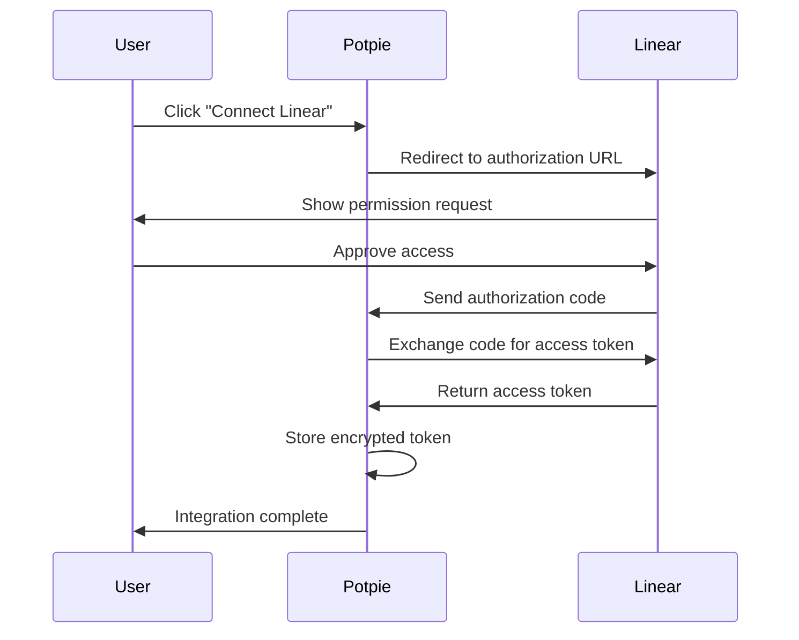

## Overview

The **Linear integration** enables Potpie agents to fetch issue details, update issue status, and manage project workflows directly within the development environment.

<CardGroup cols={2}>
  <Card title="Quick Access" icon="bolt">
    Get and update Linear issues directly through AI agents
  </Card>
  <Card title="GraphQL API" icon="diagram-project">
    Powered by Linear's GraphQL API for efficient data fetching
  </Card>
  <Card title="OAuth 2.0" icon="shield-check">
    Secure authentication with Linear OAuth 2.0
  </Card>
  <Card title="Automatic Sync" icon="arrows-rotate">
    Real-time access to Linear workspace data
  </Card>
</CardGroup>

---

## Quick Start

### Prerequisites

- Active Linear workspace
- Linear OAuth application credentials
- Potpie account with API access

### Setup Steps

<Steps>
  <Step title="Create Linear OAuth App">
    Go to [Linear Settings → API → OAuth Applications](https://linear.app/settings/api)

    Create a new OAuth application with:
    - **Name**: Potpie Integration
    - **Redirect URL**: `https://app.potpie.ai/integrations/linear/callback`
    - **Scopes**: `read` (minimum required)
  </Step>

  <Step title="Configure Environment Variables">
    Add Linear **OAuth** credentials to the environment:

    ```bash
    LINEAR_CLIENT_ID=your_linear_client_id
    LINEAR_CLIENT_SECRET=your_linear_client_secret
    ```
  </Step>

  <Step title="Connect the Workspace">
    In the Potpie dashboard:
    1. Navigate to Settings → Integrations
    2. Click **Connect** on Linear
    3. Authorize Potpie to access the Linear workspace
    4. Name the integration instance
  </Step>

  <Step title="Start Using">
    Ask agents to interact with Linear:

    *"Get details for Linear issue ABC-123"*

    *"Update Linear issue ABC-456 status to In Progress"*
  </Step>
</Steps>

---

## OAuth Setup Guide

### Creating a Linear OAuth Application

1. **Access Linear Settings**
   - Go to the Linear workspace
   - Navigate to Settings → API
   - Click **OAuth Applications**

2. **Create New Application**
   ```
   Application Name: Potpie AI Integration
   Description: AI-powered codebase assistant
   Redirect URI: https://app.potpie.ai/integrations/linear/callback
   Scopes: read (required for fetching issues)
   ```

3. **Save Credentials**
   - Copy the **Client ID**
   - Copy the **Client Secret**
   - Store both securely in environment variables

### Authorization Flow



### Scopes

| Scope | Access Level | Required |
|-------|-------------|----------|
| `read` | Read issues, teams, projects | ✅ Yes |
| `write` | Create and update issues | Optional |
| `admin` | Full workspace access | Not recommended |

<Note>
  Start with `read` scope only. Add additional scopes later if needed.
</Note>

---

## Available Tools

### 1. Get Linear Issue

Fetch detailed information about a Linear issue.

**Tool:** `get_linear_issue`

**Usage:**
```
"Get Linear issue ABC-123"
"Show me details for issue ABC-456"
"What's the status of Linear issue XYZ-789?"
```

**Returns:**
- Issue ID and key
- Title and description
- Status and state
- Assignee information
- Team and project
- Priority level
- Issue URL
- Created/updated timestamps

**GraphQL Query:**
```graphql
query GetIssue($id: String!) {
  issue(id: $id) {
    id
    title
    description
    state {
      id
      name
    }
    assignee {
      id
      name
    }
    team {
      id
      name
    }
    priority
    url
    createdAt
    updatedAt
  }
}
```

### 2. Update Linear Issue

Update properties of a Linear issue.

**Tool:** `update_linear_issue`

**Usage:**
```
"Update Linear issue ABC-123 status to In Progress"
"Change priority of issue ABC-456 to high"
"Assign Linear issue XYZ-789 to john@company.com"
```

**Updatable Fields:**
- Title
- Description
- Status/State
- Priority
- Assignee
- Team
- Labels

**GraphQL Mutation:**
```graphql
mutation UpdateIssue($id: String!, $input: IssueUpdateInput!) {
  issueUpdate(id: $id, input: $input) {
    success
    issue {
      id
      title
      state {
        name
      }
    }
  }
}
```

---

## API Integration Details

### Authentication

**Type:** OAuth 2.0
**Authorization URL:** `https://linear.app/oauth/authorize`
**Token URL:** `https://api.linear.app/oauth/token`

**Token Storage:**
- Encrypts access tokens at rest
- Stores tokens in the Potpie database
- Automatically refreshes tokens on expiration

### API Client

**Endpoint:** `https://api.linear.app/graphql`
**Method:** POST
**Content-Type:** `application/json`

**Authentication Header:**
```
Authorization: Bearer YOUR_ACCESS_TOKEN
```

**Request Format:**
```json
{
  "query": "query GetIssue($id: String!) { ... }",
  "variables": {
    "id": "issue-uuid"
  }
}
```

---

## API Reference

### Endpoints

**Base URL:** `/api/v2/integrations/linear`

| Method | Endpoint | Description |
|--------|----------|-------------|
| GET | `/oauth/authorize` | Initiate OAuth flow |
| GET | `/oauth/callback` | Handle OAuth callback |
| POST | `/save` | Save integration |
| GET | `/status/{user_id}` | Check integration status |

### Save Integration Request

```json
POST /api/v2/integrations/linear/save
{
  "code": "oauth_authorization_code",
  "redirect_uri": "https://app.potpie.ai/integrations/linear/callback",
  "instance_name": "My Linear Workspace",
  "integration_type": "linear",
  "timestamp": "2024-02-17T10:00:00Z"
}
```

### Integration Status Response

```json
{
  "user_id": "user_123",
  "is_connected": true,
  "connected_at": "2024-02-17T10:00:00Z",
  "scope": "read",
  "expires_at": "2024-03-17T10:00:00Z"
}
```

---

## Next Steps

<CardGroup cols={2}>
  <Card title="Jira Integration" icon="puzzle-piece" href="/extensions/jira">
    Connect Jira for advanced issue tracking
  </Card>
  <Card title="GitHub Integration" icon="github" href="/extensions/github">
    Link Linear issues to GitHub PRs
  </Card>
  <Card title="Custom Agents" icon="robot" href="/custom-agents/introduction">
    Create custom agents with Linear tools
  </Card>
  <Card title="API Access" icon="key" href="/agents/api-access">
    Use the Linear integration via Potpie API
  </Card>
</CardGroup>
