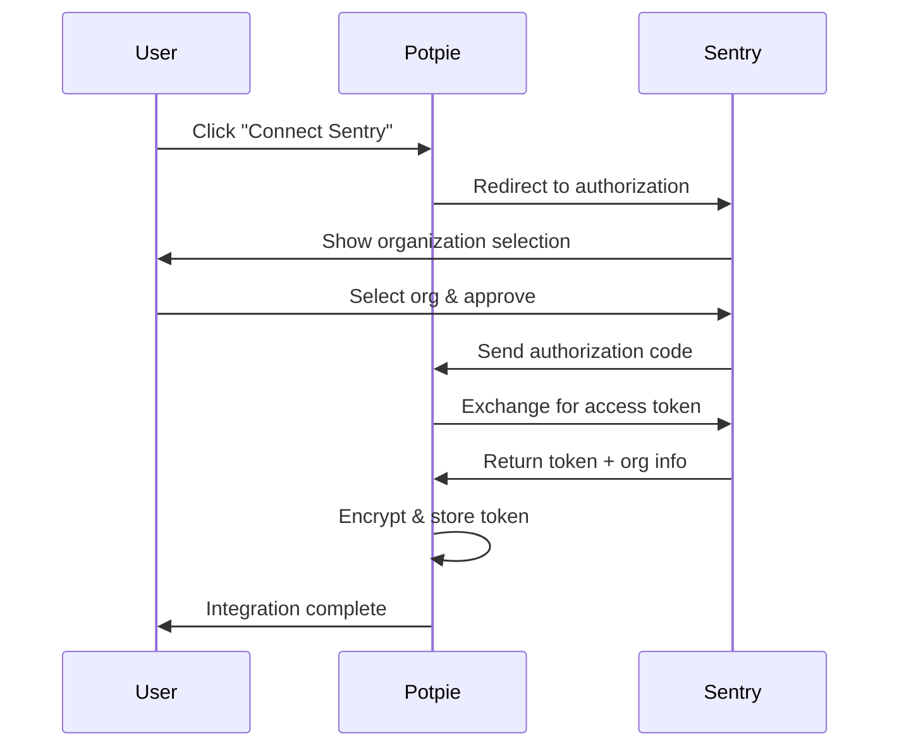

## Overview

The Sentry integration allows Potpie agents to access your error monitoring data, enabling AI-powered analysis of errors, debugging assistance, and context-aware code fixes based on production issues.

<CardGroup cols={2}>
  <Card title="Error Access" icon="bug">
    Query production errors directly through AI agents
  </Card>
  <Card title="Context-Aware" icon="brain">
    Get code context for errors automatically
  </Card>
  <Card title="OAuth 2.0" icon="shield-check">
    Secure authentication with Sentry OAuth
  </Card>
  <Card title="Multi-Organization" icon="building">
    Support for multiple Sentry organizations
  </Card>
</CardGroup>

---

## Quick Start

### Prerequisites

- Active Sentry account
- Sentry organization with projects
- Potpie account with API access

### Setup Steps

<Steps>
  <Step title="Create Sentry OAuth App">
    Go to [Sentry Settings → Developer Settings](https://sentry.io/settings/account/api/applications/)

    Create a new OAuth application:
    - **Name**: Potpie AI Integration
    - **Redirect URL**: `https://app.potpie.ai/integrations/sentry/callback`
    - **Scopes**: `org:read`, `project:read`, `event:read`
  </Step>

  <Step title="Configure Environment Variables">
    Add Sentry OAuth credentials:

    ```bash
    SENTRY_CLIENT_ID=your_sentry_client_id
    SENTRY_CLIENT_SECRET=your_sentry_client_secret
    ```
  </Step>

  <Step title="Connect Sentry Organization">
    In Potpie dashboard:
    1. Navigate to Settings → Integrations
    2. Click "Connect" on Sentry
    3. Select your organization
    4. Authorize Potpie access
    5. Name your integration
  </Step>

  <Step title="Verify Connection">
    Test the integration:

    *"Show me recent Sentry errors"*

    *"What's causing the authentication error in Sentry?"*
  </Step>
</Steps>

---

## OAuth Setup Guide

### Creating a Sentry OAuth Application

1. **Access Developer Settings**
   - Log into Sentry.io
   - Go to Settings → Account → Developer Settings
   - Click "New Public Integration"

2. **Configure Application**
   ```
   Name: Potpie AI Integration
   Webhook URL: https://app.potpie.ai/webhooks/sentry (optional)
   Redirect URL: https://app.potpie.ai/integrations/sentry/callback
   Verify SSL: ✓ (checked)
   ```

3. **Select Scopes**
   Required scopes:
   - `org:read` - Read organization data
   - `project:read` - Read project configuration
   - `event:read` - Read error events
   - `event:write` - Update error status (optional)

4. **Save Credentials**
   - Copy **Client ID**
   - Copy **Client Secret**
   - Store in environment variables

### Authorization Flow



### Token Management

**Access Token**:
- Lifetime: 1 hour
- Auto-refresh: Enabled
- Storage: Encrypted in database

**Refresh Token**:
- Used to obtain new access tokens
- Rotates on each refresh
- Encrypted storage

---

## Integration Features

### 1. Error Event Access

Access Sentry error events with full context including:
- Error message and type
- Stack traces
- User context
- Environment data
- Release information
- Breadcrumbs
- Tags and metadata

### 2. Organization Data

Query organization-level information:
- Projects list
- Team members
- Error statistics
- Release tracking
- Alert rules

### 3. Project Information

Get project-specific data:
- Configuration
- Environment settings
- Source maps
- Release deploys
- Error trends

### 4. Automatic Token Refresh

Potpie automatically:
- Detects expired tokens
- Refreshes using refresh token
- Updates stored credentials
- Retries failed requests

---

## Usage Examples

### Example 1: Query Recent Errors

**User Query**:
```
"Show me the top 5 errors from Sentry in the last 24 hours"
```

**Agent Response**:
```markdown
## Recent Sentry Errors (Last 24 hours)

### 1. TypeError: Cannot read property 'id' of undefined
- **Project**: web-frontend
- **Environment**: production
- **Occurrences**: 142 events
- **First Seen**: 23 hours ago
- **Last Seen**: 2 minutes ago
- **Affected Users**: 45
- **URL**: https://sentry.io/your-org/web-frontend/issues/123456/

### 2. ReferenceError: user is not defined
- **Project**: api-backend
- **Environment**: production
- **Occurrences**: 89 events
- **First Seen**: 18 hours ago
- **Last Seen**: 15 minutes ago
- **Affected Users**: 28
- **URL**: https://sentry.io/your-org/api-backend/issues/123457/

...
```

### Example 2: Analyze Specific Error

**User Query**:
```
"Analyze Sentry error 123456 and suggest a fix"
```

**Agent Response**:
```markdown
## Error Analysis: TypeError in Authentication

**Error**: Cannot read property 'id' of undefined

**Location**: `src/auth/middleware.js:45`

**Root Cause**:
The code attempts to access `user.id` without checking if `user` exists.
This occurs when the authentication token is invalid or expired.

**Stack Trace**:
```
at verifyToken (src/auth/middleware.js:45:20)
at middleware (src/auth/index.js:12:15)
at Layer.handle (express/lib/router/layer.js:95:5)
```

**Suggested Fix**:
```javascript
// Before
function verifyToken(req, res, next) {
  const userId = req.user.id;  // ❌ Can throw error
  // ...
}

// After
function verifyToken(req, res, next) {
  if (!req.user) {
    return res.status(401).json({ error: 'Unauthorized' });
  }
  const userId = req.user.id;  // ✅ Safe
  // ...
}
```

**Impact**: 142 occurrences, 45 affected users
**Priority**: High
```

### Example 3: Error Trend Analysis

**User Query**:
```
"Have authentication errors increased today compared to yesterday?"
```

**Agent Response**:
```markdown
## Authentication Error Trends

**Today (last 24h)**: 142 occurrences
**Yesterday**: 67 occurrences

📈 **Increase**: +112% (+75 errors)

**Breakdown by Hour**:
- 12-1 AM: 8 errors
- 1-2 AM: 5 errors
- 8-9 AM: 34 errors ⚠️ (spike)
- 9-10 AM: 28 errors ⚠️
- 2-3 PM: 18 errors

**Analysis**: Significant spike during morning hours (8-10 AM),
possibly related to the 8:15 AM deployment (Release v2.4.1).

**Recommendation**: Review changes in Release v2.4.1, particularly
authentication middleware updates.
```

---

## API Integration Details

### Authentication

**OAuth 2.0 Flow**:
- **Authorization**: `https://sentry.io/oauth/authorize/`
- **Token Exchange**: `https://sentry.io/oauth/token/`

**Headers**:
```
Authorization: Bearer YOUR_ACCESS_TOKEN
Content-Type: application/json
```

### Token Refresh

**Automatic Refresh**:
```python
# Potpie automatically refreshes when:
if token_expires_at < current_time:
    new_tokens = await refresh_sentry_token(integration_id)
    # Updates database with new tokens
```

**Manual Refresh** (if needed):
```bash
POST https://sentry.io/oauth/token/
Content-Type: application/x-www-form-urlencoded

grant_type=refresh_token&
client_id=YOUR_CLIENT_ID&
client_secret=YOUR_CLIENT_SECRET&
refresh_token=YOUR_REFRESH_TOKEN
```

### API Endpoints

**Base URL**: `https://sentry.io/api/0/`

Common endpoints:
- `/organizations/` - List organizations
- `/organizations/{org}/projects/` - List projects
- `/organizations/{org}/issues/` - List error issues
- `/projects/{org}/{project}/events/` - List events
- `/organizations/{org}/stats_v2/` - Error statistics

---

## Troubleshooting

### Issue: "Integration not found"

**Cause**: Sentry integration not connected or token expired

**Solution**:
<Steps>
  <Step title="Check Status">
    ```bash
    GET /api/v2/integrations/sentry/status/{user_id}
    ```
  </Step>
  <Step title="Reconnect">
    - Go to Settings → Integrations
    - Click "Reconnect" on Sentry
    - Complete OAuth flow
  </Step>
  <Step title="Verify">
    Test connection with a simple query
  </Step>
</Steps>

### Issue: "Insufficient permissions"

**Cause**: OAuth scopes missing required permissions

**Solution**:
1. Revoke current integration
2. Create new OAuth app with required scopes:
   - `org:read`
   - `project:read`
   - `event:read`
3. Reconnect integration

### Issue: "Organization not accessible"

**Cause**: User not a member of the organization

**Solution**:
- Verify organization membership in Sentry
- Check if organization is on a paid plan
- Ensure OAuth app is authorized for the org

### Issue: "Token refresh failed"

**Cause**: Refresh token expired or revoked

**Solution**:
1. Delete existing integration
2. Reconnect with new OAuth flow
3. Verify credentials in environment variables

---

## API Reference

### Endpoints

**Base**: `/api/v2/integrations/sentry`

| Method | Endpoint | Description |
|--------|----------|-------------|
| GET | `/oauth/authorize` | Start OAuth flow |
| GET | `/oauth/callback` | Handle OAuth callback |
| POST | `/save` | Save integration |
| GET | `/status/{user_id}` | Check status |
| DELETE | `/revoke/{user_id}` | Revoke access |

### Save Integration

```json
POST /api/v2/integrations/sentry/save
{
  "code": "oauth_authorization_code",
  "redirect_uri": "https://app.potpie.ai/integrations/sentry/callback",
  "instance_name": "My Sentry Org",
  "integration_type": "sentry",
  "timestamp": "2024-02-17T10:00:00Z"
}
```

**Response**:
```json
{
  "success": true,
  "data": {
    "integration_id": "int_abc123",
    "integration_type": "sentry",
    "status": "active",
    "scope_data": {
      "org_slug": "your-org",
      "installation_id": "install_123"
    }
  },
  "error": null
}
```

### Check Status

```json
GET /api/v2/integrations/sentry/status/{user_id}

Response:
{
  "user_id": "user_123",
  "is_connected": true,
  "connected_at": "2024-02-17T10:00:00Z",
  "scope": "org:read project:read event:read",
  "expires_at": "2024-02-17T11:00:00Z"
}
```

---

## Security Best Practices

<AccordionGroup>
  <Accordion title="Credential Management" icon="key">
    - Store OAuth credentials in environment variables
    - Never commit credentials to version control
    - Rotate credentials every 90 days
    - Use separate apps for dev/staging/prod
    - Monitor integration access logs
  </Accordion>

  <Accordion title="Scope Permissions" icon="shield">
    - Request minimum required scopes
    - Start with read-only access
    - Add write permissions only when needed
    - Review permissions regularly
    - Revoke unused integrations
  </Accordion>

  <Accordion title="Token Security" icon="lock">
    - Tokens encrypted at rest in database
    - Automatic token refresh
    - Secure transmission over HTTPS
    - No token logging
    - Immediate revocation on security concerns
  </Accordion>
</AccordionGroup>

---

## Rate Limits

Sentry API rate limits:
- **Burst**: 10 requests per second
- **Sustained**: 3,000 requests per hour
- **Daily**: 50,000 requests per day

Potpie handles rate limiting automatically:
- Exponential backoff on 429 errors
- Request queuing
- Rate limit monitoring
- Graceful degradation

---

## Support & Resources

<CardGroup cols={2}>
  <Card title="Sentry Documentation" icon="book" href="https://docs.sentry.io/">
    Official Sentry documentation
  </Card>
  <Card title="OAuth Documentation" icon="shield-halved" href="https://docs.sentry.io/product/partnership-platform/oauth-integration/">
    Sentry OAuth integration guide
  </Card>
  <Card title="API Reference" icon="code" href="https://docs.sentry.io/api/">
    Sentry API documentation
  </Card>
  <Card title="Potpie Support" icon="life-ring" href="mailto:hi@potpie.ai">
    Contact support team
  </Card>
</CardGroup>

---

## What's Next?

<CardGroup cols={2}>
  <Card title="GitHub Integration" icon="github" href="/extensions/github">
    Link Sentry errors to GitHub issues
  </Card>
  <Card title="Jira Integration" icon="puzzle-piece" href="/extensions/jira">
    Create Jira tickets from Sentry errors
  </Card>
  <Card title="Custom Agents" icon="robot" href="/custom-agents/introduction">
    Build agents that analyze errors
  </Card>
  <Card title="Debugging Agent" icon="bug" href="/agents/debugging-agent">
    Use AI to debug Sentry errors
  </Card>
</CardGroup>
