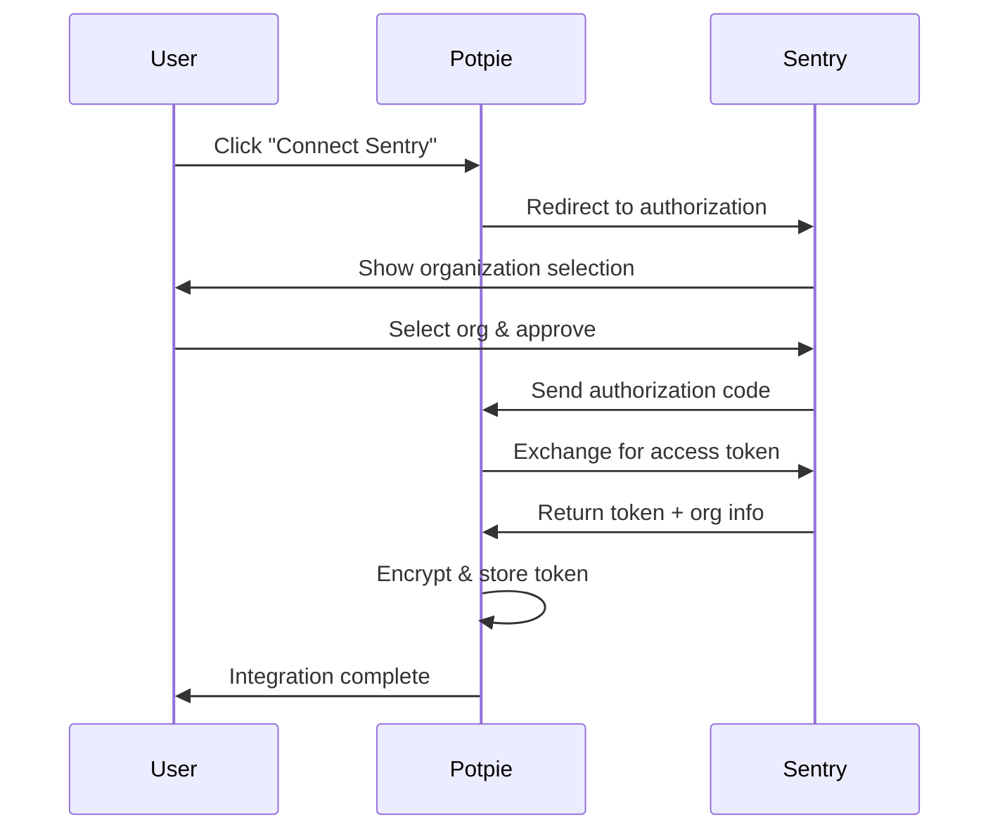

## Overview

The **Sentry** integration gives Potpie agents access to **error monitoring** data for AI-powered analysis, debugging assistance, and code fixes based on production issues.

<CardGroup cols={2}>
  <Card title="Error Access" icon="bug">
    Query production errors directly through AI agents
  </Card>
  <Card title="Context-Aware" icon="brain">
    Get code context for errors automatically
  </Card>
  <Card title="OAuth 2.0" icon="shield-check">
    Secure authentication with Sentry OAuth
  </Card>
  <Card title="Multi-Organization" icon="building">
    Support for multiple Sentry organizations
  </Card>
</CardGroup>

---

## Quick Start

### Prerequisites

- Active Sentry account
- Sentry organization with projects
- Potpie account with API access

### Setup Steps

<Steps>
  <Step title="Create Sentry OAuth App">
    Go to <a href="https://sentry.io/settings/account/api/applications/" className="mode-link">Sentry Settings → Developer Settings</a>

    Create a new OAuth application:
    - **Name**: Potpie AI Integration
    - **Redirect URL**: `https://app.potpie.ai/integrations/sentry/callback`
    - **Scopes**: `org:read`, `project:read`, `event:read`
  </Step>

  <Step title="Configure Environment Variables">
    Add Sentry **OAuth** credentials:

    ```bash
    SENTRY_CLIENT_ID=your_sentry_client_id
    SENTRY_CLIENT_SECRET=your_sentry_client_secret
    ```
  </Step>

  <Step title="Connect Sentry Organization">
    In the Potpie dashboard:
    1. Navigate to Settings → Integrations
    2. Click **Connect** on Sentry
    3. Select the organization
    4. Authorize Potpie access
    5. Name the integration
  </Step>

  <Step title="Verify Connection">
    Test the integration:

    *"Show me recent Sentry errors"*

    *"What's causing the authentication error in Sentry?"*
  </Step>
</Steps>

---

## OAuth Setup Guide

### Creating a Sentry OAuth Application

1. **Access Developer Settings**
   - Log into Sentry.io
   - Go to Settings → Account → Developer Settings
   - Click **New Public Integration**

2. **Configure Application**
   ```
   Name: Potpie AI Integration
   Webhook URL: https://app.potpie.ai/webhooks/sentry (optional)
   Redirect URL: https://app.potpie.ai/integrations/sentry/callback
   Verify SSL: ✓ (checked)
   ```

3. **Select Scopes**
   Required scopes:
   - `org:read` - Read organization data
   - `project:read` - Read project configuration
   - `event:read` - Read error events
   - `event:write` - Update error status (optional)

4. **Save Credentials**
   - Copy **Client ID**
   - Copy **Client Secret**
   - Store in environment variables

### Authorization Flow



### Token Management

**Access Token**:
- **Lifetime**: 1 hour
- **Auto-refresh**: Enabled
- **Storage**: Encrypted at rest

**Refresh Token**:
- Obtains new access tokens
- Rotates on each refresh
- Encrypted at rest

---

## API Integration Details

### Authentication

**OAuth 2.0 Flow**:
- **Authorization**: `https://sentry.io/oauth/authorize/`
- **Token Exchange**: `https://sentry.io/oauth/token/`

**Headers**:
```
Authorization: Bearer YOUR_ACCESS_TOKEN
Content-Type: application/json
```

### Token Refresh

**Automatic Refresh**:
```python
# Potpie automatically refreshes when:
if token_expires_at < current_time:
    new_tokens = await refresh_sentry_token(integration_id)
    # Updates database with new tokens
```

**Manual Refresh** (if needed):
```bash
POST https://sentry.io/oauth/token/
Content-Type: application/x-www-form-urlencoded

grant_type=refresh_token&
client_id=YOUR_CLIENT_ID&
client_secret=YOUR_CLIENT_SECRET&
refresh_token=YOUR_REFRESH_TOKEN
```

### API Endpoints

**Base URL**: `https://sentry.io/api/0/`

Common endpoints:
- `/organizations/` - List organizations
- `/organizations/{org}/projects/` - List projects
- `/organizations/{org}/issues/` - List error issues
- `/projects/{org}/{project}/events/` - List events
- `/organizations/{org}/stats_v2/` - Error statistics

---

## API Reference

### Endpoints

**Base**: `/api/v2/integrations/sentry`

| Method | Endpoint | Description |
|--------|----------|-------------|
| GET | `/oauth/authorize` | Start OAuth flow |
| GET | `/oauth/callback` | Handle OAuth callback |
| POST | `/save` | Save integration |
| GET | `/status/{user_id}` | Check status |
| DELETE | `/revoke/{user_id}` | Revoke access |

### Save Integration

```json
POST /api/v2/integrations/sentry/save
{
  "code": "oauth_authorization_code",
  "redirect_uri": "https://app.potpie.ai/integrations/sentry/callback",
  "instance_name": "My Sentry Org",
  "integration_type": "sentry",
  "timestamp": "2024-02-17T10:00:00Z"
}
```

**Response**:
```json
{
  "success": true,
  "data": {
    "integration_id": "int_abc123",
    "integration_type": "sentry",
    "status": "active",
    "scope_data": {
      "org_slug": "your-org",
      "installation_id": "install_123"
    }
  },
  "error": null
}
```

### Check Status

```json
GET /api/v2/integrations/sentry/status/{user_id}

Response:
{
  "user_id": "user_123",
  "is_connected": true,
  "connected_at": "2024-02-17T10:00:00Z",
  "scope": "org:read project:read event:read",
  "expires_at": "2024-02-17T11:00:00Z"
}
```

---

## Next Steps

<CardGroup cols={2}>
  <Card title="GitHub Integration" icon="github" href="/extensions/github">
    Link Sentry errors to GitHub issues
  </Card>
  <Card title="Jira Integration" icon="puzzle-piece" href="/extensions/jira">
    Create Jira tickets from Sentry errors
  </Card>
  <Card title="Custom Agents" icon="robot" href="/custom-agents/introduction">
    Build agents that analyze errors
  </Card>
  <Card title="Debug an Issue" icon="bug" href="/build-flow/debug-an-issue">
    Use AI to debug Sentry errors
  </Card>
</CardGroup>
