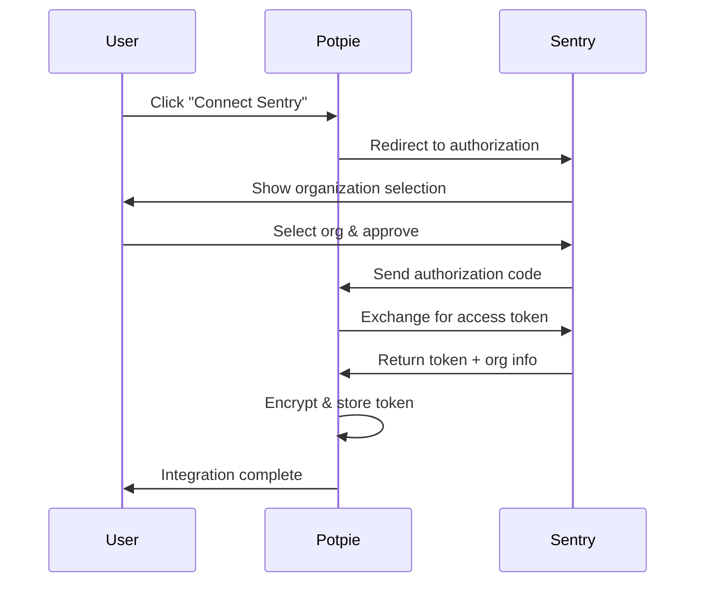

## Overview

The **Sentry** integration connects Potpie to your Sentry organization via OAuth. Once connected, Potpie receives error event webhooks from Sentry and can query issue data through the Sentry API.

---

## Setup

<Steps>
  <Step title="Create a Sentry OAuth Application">
    Log into <a href="https://sentry.io/settings/account/api/applications/" className="mode-link">Sentry.io</a> and go to **Settings → Account → Developer Settings**.

    Click **New Public Integration** and configure:

    | Field | Value |
    |-------|-------|
    | Name | Potpie AI Integration |
    | Webhook URL | `https://app.potpie.ai/integrations/sentry/webhook` |
    | Redirect URL | `https://app.potpie.ai/integrations/sentry/callback` |
    | Verify SSL | ✓ |

    Select recommended scopes:
    - `org:read` — Read organization data
    - `project:read` — Read project configuration
    - `event:read` — Read error events
    - `event:write` — Update error status (optional)

    Save and copy the **Client ID** and **Client Secret**.
  </Step>

  <Step title="Configure Environment Variables">
    Add your Sentry OAuth credentials:

    ```bash
    SENTRY_CLIENT_ID=your_sentry_client_id
    SENTRY_CLIENT_SECRET=your_sentry_client_secret
    ```
  </Step>

  <Step title="Connect via Potpie Dashboard">
    In the Potpie dashboard:
    1. Navigate to **Settings → Integrations**
    2. Click **Connect** on Sentry
    3. Select your organization
    4. Authorize Potpie access
    5. Name the integration

    After authorization completes, the Sentry integration status shows as **active**.
  </Step>
</Steps>

---

## Authorization Flow



---

## Token Management

Potpie stores tokens encrypted at rest and refreshes them automatically.

| Token | Lifetime | Behavior |
|-------|----------|----------|
| Access token | 1 hour | Auto-refreshed before expiry |
| Refresh token | Long-lived | Rotates on each refresh |

OAuth endpoint URLs and token refresh details are available in the <a href="https://docs.sentry.io/api/auth/" className="mode-link">Sentry API reference</a>.

---

## Sentry API Reference

**Base URL**: `https://sentry.io/api/0/`

| Endpoint | Description |
|----------|-------------|
| `/organizations/` | List organizations |
| `/organizations/{org}/projects/` | List projects |
| `/projects/{org}/{project}/issues/` | List error issues |
| `/projects/{org}/{project}/events/` | List events |

---

## Potpie API Reference

**Base**: `/api/v2/integrations/sentry`

| Method | Endpoint | Description |
|--------|----------|-------------|
| POST | `/initiate` | Start OAuth flow |
| GET | `/oauth/callback` | Handle OAuth callback |
| POST | `/save` | Save integration |
| GET | `/status/{user_id}` | Check status |
| DELETE | `/revoke/{user_id}` | Revoke access |

### Save Integration

```json
POST /api/v2/integrations/sentry/save
{
  "code": "oauth_authorization_code",
  "redirect_uri": "https://app.potpie.ai/integrations/sentry/callback",
  "instance_name": "My Sentry Org",
  "integration_type": "sentry",
  "timestamp": "2024-02-17T10:00:00Z"
}
```

**Response**:
```json
{
  "success": true,
  "data": {
    "integration_id": "int_abc123",
    "integration_type": "sentry",
    "status": "active",
    "scope_data": {
      "org_slug": "your-org",
      "installation_id": "install_123"
    }
  },
  "error": null
}
```

### Check Status

```json
GET /api/v2/integrations/sentry/status/{user_id}

Response:
{
  "user_id": "user_123",
  "is_connected": true,
  "connected_at": "2024-02-17T10:00:00Z",
  "scope": "org:read project:read event:read",
  "expires_at": "2024-02-17T11:00:00Z"
}
```
